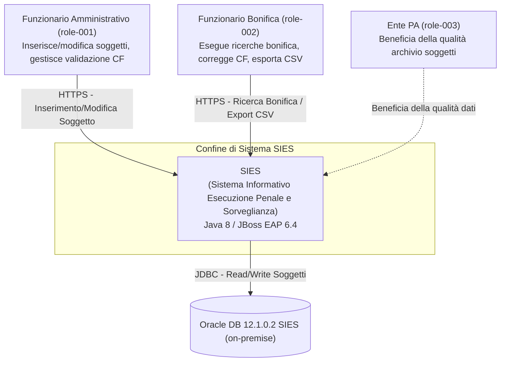
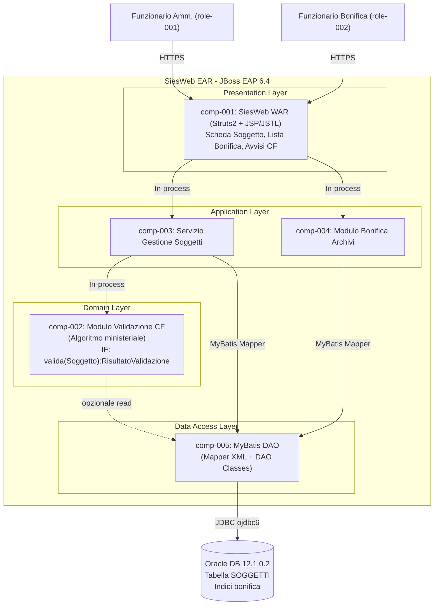
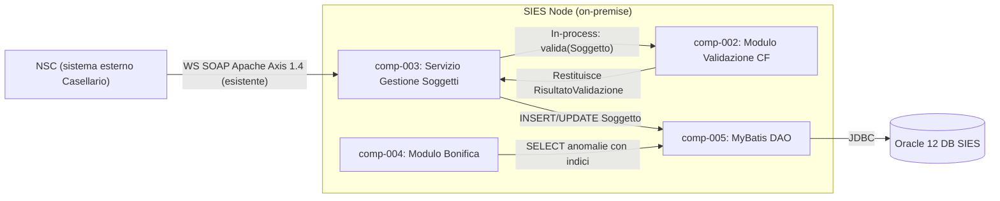

# architecture_design

## architecture_summary

| attributo | valore |
|---|---|
| primary_style | Layered Monolith (architettura a strati integrata nel sistema SIES esistente) |
| architecture_quanta | 1 |
| total_services | 1 deployment unit (SiesWeb EAR su JBoss EAP 6.4) |
| total_adrs | 5 |
| tech_stack_specs_used | SIUT SIES AR 1.6 — 2024-02-14 (Oracle JVM 1.8, JBoss EAP 6.4, Oracle 12.1.0.2, Struts2, MyBatis3) |
| communication_pattern | Synchronous (chiamate in-process JEE) |
| data_strategy | Shared Database (Oracle 12 SIES esistente, schema condiviso) |

## architecture_characteristics

| Caratteristica | Score | Evidenza dagli artefatti |
|---|---|---|
| Scalabilità | 1 | Sistema on-premise PA con numero fisso di nodi SIES distribuiti territorialmente. Funzionalità CF aggiunta a sistema esistente, non richiede scalabilità orizzontale indipendente. |
| Elasticità | 1 | Infrastruttura on-premise RedHat Linux fissa. Nessun requisito di scaling dinamico. |
| Tolleranza ai guasti | 2 | NFR-003: disponibilità durante orario lavorativo lunedì–venerdì. Nessun requisito di 24/7 HA. JBoss EAP 6.4 gestisce failover di base. |
| Deployabilità | 2 | Sistema PA con rilasci pianificati. Deployment su JBoss EAP in orari di manutenzione. La nuova funzionalità CF deve integrarsi nell'EAR esistente (SiesWeb). |
| Testabilità | 2 | NFR-007 richiede isolamento del modulo CF per aggiornamenti e test indipendenti. 54 test cases derivati in TEST_SPEC (UW-001÷012). |
| Modularità | 2 | NFR-007: algoritmo CF in modulo dedicato. Due aree funzionali distinte (FA-001 validazione, FA-002 bonifica). |
| Prestazioni | 3 | NFR-001: validazione CF < 2s con 100 utenti simultanei. NFR-002: ricerca bonifica < 60s su 10.000 soggetti. Critico per l'adozione operativa. |
| Semplicità | 3 | Contesto PA, team di manutenzione, sistema legacy J2EE. Costo di comprensione e manutenzione deve essere minimizzato. Nessuna infrastruttura distribuita giustificata. |
| Evolvibilità | 2 | NFR-007: algoritmo ministeriale CF soggetto a variazioni normative. L'isolamento del modulo CF è il principale requisito di evolvibilità. |
| Costo | 3 | Infrastruttura esistente (JBoss EAP + Oracle). Minimizzare TCO su sistema on-premise PA. Nessun costo per nuova infrastruttura. |

## style_fitness_evaluation

| Stile Architetturale | Scalabilità | Elasticità | Tolleranza Guasti | Deployabilità | Testabilità | Modularità | Semplicità | Costo | Fit Totale |
|---|---|---|---|---|---|---|---|---|---|
| **Layered Monolith** | ★ | ★ | ★★ | ★★★ | ★★★ | ★★ | ★★★ | ★★★ | **Alto** |
| Service-Based | ★★ | ★★ | ★★ | ★★ | ★★ | ★★★ | ★★ | ★★ | Medio |
| Microservices | ★★★ | ★★★ | ★★★ | ★ | ★★ | ★★★ | ✗ | ✗ | **Basso** |
| Event-Driven | ★ | ★ | ★★★ | ★ | ★ | ★★ | ✗ | ★ | **Molto Basso** |

> Legenda: ★★★ = forte fit | ★★ = fit moderato | ★ = fit debole | ✗ = fit scarso

**Stile selezionato: Layered Monolith** — massima coerenza con il tech stack esistente (JEE JBoss EAP), minimizzazione dei costi, semplicità di manutenzione.

## architecture_decision_records

### ADR-001: Stile Architetturale Primario — Layered Monolith

**Status:** Proposed | **Data:** 2026-06-16

**Contesto:** Il sistema SIES è un'applicazione JEE esistente su JBoss EAP 6.4 con Oracle 12 (AR 1.6). Le nuove funzionalità CF (FA-001, FA-002) si aggiungono a un sistema PA on-premise. Driver primari: Prestazioni (NFR-001, NFR-002), Semplicità, Costo. Il documento di reingegnerizzazione SIUS identifica una strategia di modernizzazione progressiva a moduli.

**Decisione:** Adottare **Layered Monolith** (Presentation → Application → Domain → Data). Le funzionalità CF si integrano nell'EAR SiesWeb esistente come nuovi moduli (comp-002 Validazione CF, comp-004 Bonifica).

**Alternative Considerate:**

| Alternativa | Pro | Contro | Fitness Score |
|---|---|---|---|
| **Layered Monolith (scelta)** | Coerente con JEE esistente; deployment semplice; costo minimizzato | Scalabilità limitata; coupling tight su Data Access Layer | 8/10 |
| Service-Based | Migliore isolamento modulo CF | Complessità aggiuntiva; richiederebbe API Gateway non presente | 5/10 |
| Microservices | Massima scalabilità | Incompatibile con Java 8 + JBoss EAP on-premise | 1/10 |
| Event-Driven | Disaccoppiamento massimo | JMS non giustificato per validazione sincrona | 2/10 |

**Conseguenze:** + deployment semplificato; - coupling sul DAL (dep-004, dep-005); rischio risk-002 → mitigato con indici Oracle.

**Riferimenti:** SIUT SIES AR 1.6, comp-001÷005, NFR-001, NFR-002, NFR-007

---

### ADR-002: Pattern di Comunicazione — Sincrono In-Process

**Status:** Proposed | **Data:** 2026-06-16

**Contesto:** I processi proc-001 (Validazione CF) e proc-002 (Ricerca Bonifica) sono sincroni: il funzionario attende l'esito (NFR-001 < 2s, NFR-002 < 60s). JMS Open MQ è presente per messaggistica inter-nodo ma non rilevante per queste funzionalità intra-nodo.

**Decisione:** Comunicazione **sincrona in-process** (chiamate dirette tra componenti JEE nello stesso EAR). Nessun uso di JMS per le funzionalità CF.

**Alternative Considerate:**

| Alternativa | Pro | Contro | Fitness Score |
|---|---|---|---|
| **Sincrono In-Process (scelta)** | Semplicità; latenza minima; coerente con NFR-001 | Nessun decoupling temporale | 9/10 |
| Asincrono JMS | Decoupling | NFR-001 richiede risposta < 2s; JMS aggiunge latenza non necessaria | 3/10 |

**Conseguenze:** + latenza minimizzata; - errori nel Modulo CF (dep-003) propagano al chiamante (risk-003).

**Riferimenti:** proc-001, proc-002, NFR-001, NFR-002, dep-003

---

### ADR-003: Strategia dei Dati — Database Oracle Condiviso

**Status:** Proposed | **Data:** 2026-06-16

**Contesto:** ent-001 (Soggetto) è già persistita in Oracle 12.1.0.2 SIES (AR 1.6). Le funzionalità CF aggiungono l'attributo codiceFiscale e richiedono ricerche di massa sull'archivio soggetti.

**Decisione:** Utilizzare il **database Oracle SIES esistente** (schema condiviso). Modifiche minime: aggiunta campo codiceFiscale su tabella soggetti; aggiunta indici composti (paeseNascita, codiceFiscale) per NFR-002.

**Alternative Considerate:**

| Alternativa | Pro | Contro | Fitness Score |
|---|---|---|---|
| **Oracle Condiviso (scelta)** | Nessuna migrazione; coerenza transazionale; costo zero | Coupling su DB (dep-004, dep-005, risk-001) | 9/10 |
| Database separato per CF | Isolamento | Sincronizzazione dati tra due DB; complessità insostenibile | 1/10 |

**Conseguenze:** + nessuna duplicazione dati; - tutti i componenti dipendono da comp-005 (risk-001); query bonifica devono essere ottimizzate (risk-002).

**Riferimenti:** SIUT SIES AR 1.6: Oracle 12.1.0.2, ent-001, ent-005, ent-006, dep-004, dep-005

---

### ADR-004: Isolamento Modulo Algoritmo CF

**Status:** Proposed | **Data:** 2026-06-16

**Contesto:** NFR-007 richiede: «Logica calcolo/validazione CF in modulo dedicato, modificabile indipendentemente». L'algoritmo ministeriale italiano del CF è soggetto a variazioni normative (dep-003 deve essere gestito tramite interfaccia stabile).

**Decisione:** Implementare comp-002 come **modulo Java con interfaccia pubblica stabile**: `valida(Soggetto): RisultatoValidazione`. Nessuna dipendenza da Struts2 o DAO all'interno del modulo. Copertura con test unitari parametrici (UW-001÷004).

**Alternative Considerate:**

| Alternativa | Pro | Contro | Fitness Score |
|---|---|---|---|
| **Modulo Java isolato (scelta)** | Aggiornabile indipendentemente; testabile in isolamento | Interfaccia pubblica da mantenere stabile | 10/10 |
| Algoritmo inline nel Service | Semplicità iniziale | Violazione NFR-007; aggiornamento algoritmo richiede toccare il Service | 2/10 |

**Conseguenze:** + aggiornamenti normativi CF senza impatto sullo strato applicativo.

**Riferimenti:** NFR-007, comp-002, dep-003, risk-003

---

### ADR-005: Controllo degli Accessi al Modulo Bonifica

**Status:** Proposed | **Data:** 2026-06-16

**Contesto:** NFR-005 richiede accesso limitato al modulo bonifica (comp-004) agli utenti con profilo autorizzato (role-002). JBoss EAP 6.4 supporta JAAS/JBoss Security con gestione ruoli JEE standard.

**Decisione:** Applicare **controllo degli accessi basato su ruoli JBoss EAP** (security domain SIES esistente). Solo role-002 accede alle funzioni bonifica. Il controllo avviene a livello di action Struts2 (interceptor di autorizzazione).

**Alternative Considerate:**

| Alternativa | Pro | Contro | Fitness Score |
|---|---|---|---|
| **Ruoli JBoss EAP (scelta)** | Coerente con security domain SIES; nessuna infrastruttura aggiuntiva | Dipende dalla corretta configurazione profili utente | 9/10 |
| Controllo a livello DB | Sicurezza profonda | Duplicazione logica autorizzazione; complessità gestione | 4/10 |

**Conseguenze:** + allineamento con policy PA esistenti; rischio: misconfiguration del profilo → accesso non autorizzato all'archivio.

**Riferimenti:** NFR-005, comp-001, comp-004, dep-002, role-002

---

## c4_context_diagram

## c4_container_diagram

## component_service_mapping

| component_id | component_name | service_name | deployment_unit | communication |
|---|---|---|---|---|
| comp-001 | Presentation Layer SIES Web | SiesWeb WAR | SiesWeb EAR su JBoss EAP 6.4 | HTTP/HTTPS (Struts2 Action) |
| comp-002 | Modulo Validazione CF | Modulo Java CF | SiesWeb EAR (stesso deployment) | In-process (chiamata diretta Java) |
| comp-003 | Servizio Gestione Soggetti | Gestione Soggetti Service | SiesWeb EAR su JBoss EAP 6.4 | In-process (chiamata diretta Java) |
| comp-004 | Modulo Bonifica Archivi | Bonifica Archivi Service | SiesWeb EAR su JBoss EAP 6.4 | In-process (chiamata diretta Java) |
| comp-005 | Data Access Layer | MyBatis DAO | SiesWeb EAR su JBoss EAP 6.4 | JDBC (ojdbc6 → Oracle 12) |

## integration_architecture

## cross_cutting_concerns

| Concern | Pattern | Tecnologia | ADR Reference |
|---|---|---|---|
| Autenticazione | Autenticazione integrata JBoss Security Domain (JAAS) | JBoss EAP 6.4 Security Domain, OpenSAML | ADR-005 |
| Autorizzazione | Role-Based Access Control — Struts2 interceptor + JBoss roles | JBoss EAP roles (role-001, role-002), Struts2 interceptor | ADR-005 |
| Logging | Logging strutturato a livello Service e Modulo CF | Logback 1.1.7 + SLF4J 1.7.21 (esistente SiesWeb) | ADR-001 |
| Gestione Errori | Exception propagation sincrona con fallback UI | Struts2 Result + messaggi JSP non bloccanti | ADR-002 |
| Prestazioni DB | Indici composti su tabella soggetti per ricerche bonifica | Oracle 12 — INDEX su (paeseNascita, codiceFiscale) | ADR-003 |
| Testabilità CF | Modulo CF con interfaccia pubblica stabile per test unitari | JUnit 3.8.1 (presente in dipendenze SiesWeb) | ADR-004 |
| Configurazione | Configurazione application server JBoss EAP | standalone.xml / domain.xml JBoss EAP | ADR-001 |

## architecture_quantum_analysis

| quantum_id | quantum_name | services | coupling_point | caratteristiche |
|---|---|---|---|---|
| q-001 | SIES CF Quantum | SiesWeb EAR (comp-001÷005) | Oracle DB SIES condiviso + deployment JBoss EAP 6.4 | Deployabilità congiunta, Prestazioni, Semplicità, Costo contenuto — singola unità architetturale |

> Con architettura Layered Monolith su deployment unit singolo (EAR), l'intero sistema costituisce un solo quantum architetturale. La coesione è garantita dal database Oracle condiviso e dal singolo contesto di deployment JBoss EAP.

ARCHITECTURE_DESIGN_COMPLETED: 5 ADR prodotti, 1 quantum identificato, primary style: Layered Monolith