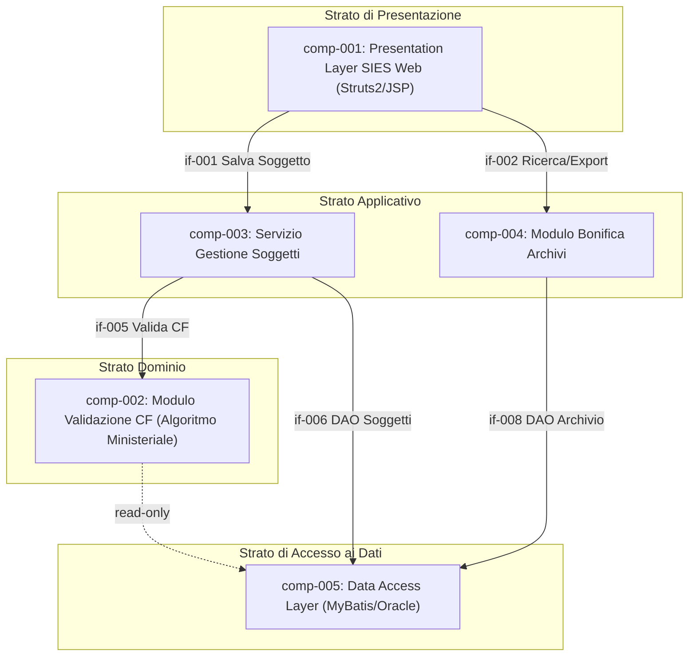

# logical_components

## component_catalog

| component_id | component_name | component_type | component_description | responsibility | owned_entities | supported_processes | related_feature_ids |
|---|---|---|---|---|---|---|---|
| comp-001 | Presentation Layer SIES Web | Layer | Strato di presentazione web che gestisce l'interfaccia utente per la scheda soggetto e il modulo bonifica. Implementato con Struts 2 e JSP/JSTL su JBoss EAP. | Ricevere input utente, mostrare schede soggetto, avvisi CF non bloccanti, lista bonifica e controlli di esportazione. | — | proc-001, proc-002, proc-003, proc-004 | FEAT-001, FEAT-002, FEAT-003, FEAT-004, FEAT-005 |
| comp-002 | Modulo Validazione Codice Fiscale | Module | Modulo applicativo dedicato al calcolo del CF atteso tramite algoritmo ministeriale, alla verifica formale e al confronto congruenza. Isolato per consentire aggiornamenti normativi indipendenti (NFR-007). | Calcolare CF atteso; verificare formato; confrontare CF inserito con CF atteso; produrre RisultatoValidazione. | ent-002, ent-003, ent-004 | proc-001 | FEAT-001, FEAT-002, FEAT-003 |
| comp-003 | Servizio Gestione Soggetti | Service | Servizio applicativo orchestratore del ciclo di vita del soggetto: inserimento, modifica, salvataggio. Invoca il Modulo Validazione CF ad ogni salvataggio e propaga il risultato alla Presentation Layer. | Gestire CRUD soggetti; orchestrare la validazione CF al salvataggio; restituire esito con avvisi non bloccanti. | ent-001 | proc-001, proc-003 | FEAT-001, FEAT-002, FEAT-003 |
| comp-004 | Modulo Bonifica Archivi | Module | Modulo applicativo che esegue le ricerche di massa sull'archivio per tipologia di anomalia CF, supporta la navigazione alla scheda soggetto e genera il file CSV di export. | Eseguire ricerche bonifica (CF assente, non valido, non congruente); produrre RicercaBonifica e RigaBonifica; generare CSV. | ent-005, ent-006 | proc-002, proc-003, proc-004 | FEAT-004, FEAT-005 |
| comp-005 | Data Access Layer | Layer | Strato di accesso ai dati Oracle tramite MyBatis DAO. Responsabile delle query SQL per soggetti e ricerche bonifica. Centrale per tutti i componenti applicativi. | Accesso in lettura/scrittura alle tabelle Oracle (soggetti, archivio). Esecuzione query bonifica ottimizzate per NFR-002 (≤60s su 10.000 soggetti). | ent-001, ent-005, ent-006 | proc-001, proc-002, proc-003, proc-004 | FEAT-001, FEAT-002, FEAT-003, FEAT-004, FEAT-005 |

## component_interfaces

| component_id | interface_id | interface_direction | interface_name | interface_description | data_entities |
|---|---|---|---|---|---|
| comp-001 | if-001 | Required | Interfaccia Gestione Soggetti | La Presentation Layer invoca il Servizio Gestione Soggetti per il salvataggio del soggetto. | ent-001 |
| comp-001 | if-002 | Required | Interfaccia Bonifica | La Presentation Layer invoca il Modulo Bonifica per ricerca, navigazione ed export. | ent-005, ent-006 |
| comp-002 | if-003 | Provided | API Validazione CF | Espone la funzione di validazione: dato un Soggetto, restituisce RisultatoValidazione con eventuale AnomaliaCodiceFiscale e CF atteso. | ent-002, ent-003, ent-004 |
| comp-003 | if-004 | Provided | API Salvataggio Soggetto | Espone le operazioni di inserimento e modifica soggetto. Orchestratore della validazione CF. | ent-001 |
| comp-003 | if-005 | Required | Interfaccia Validazione CF | Il Servizio Gestione Soggetti invoca il Modulo Validazione CF prima di completare il salvataggio. | ent-002, ent-004 |
| comp-003 | if-006 | Required | Interfaccia DAO Soggetti | Il Servizio Gestione Soggetti legge/scrive ent-001 tramite il Data Access Layer. | ent-001 |
| comp-004 | if-007 | Provided | API Ricerca Bonifica | Espone le operazioni di ricerca per tipologia anomalia, produzione lista e export CSV. | ent-005, ent-006 |
| comp-004 | if-008 | Required | Interfaccia DAO Archivio | Il Modulo Bonifica legge l'archivio soggetti tramite il Data Access Layer. | ent-001, ent-006 |
| comp-005 | if-009 | Provided | DAO Soggetti | Fornisce le operazioni CRUD su Soggetto verso il database Oracle. | ent-001 |
| comp-005 | if-010 | Provided | DAO Bonifica | Fornisce le query di ricerca anomalie CF sull'archivio per il Modulo Bonifica. | ent-005, ent-006 |

## component_diagram

COMPONENTS_COMPLETED