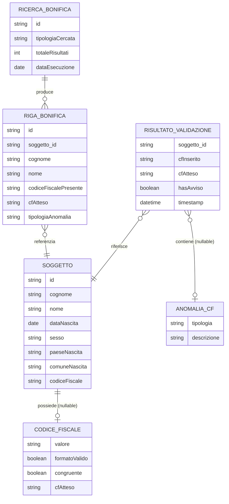

# logical_entities

## bounded_contexts

| context_id | context_name | context_description |
|---|---|---|
| ctx-001 | Gestione Soggetti | Gestisce il ciclo di vita dei soggetti censiti in SIES: inserimento, modifica, persistenza dei dati anagrafici compreso il codice fiscale come attributo del soggetto. |
| ctx-002 | Validazione Codice Fiscale | Racchiude la logica di calcolo dell'algoritmo ministeriale del CF, la verifica formale (formato e carattere di controllo) e il confronto congruenza con i dati anagrafici. |
| ctx-003 | Bonifica Archivi | Gestisce le ricerche di massa sull'archivio per identificare soggetti con anomalie CF (assente, non valido, non congruente) e supporta le operazioni di esportazione dei risultati. |

## entities

| entity_id | entity_name | entity_type | bounded_context_id | entity_description | key_attributes | related_requirement_ids |
|---|---|---|---|---|---|---|
| ent-001 | Soggetto | Aggregate Root | ctx-001 | Persona censita in SIES soggetta a esecuzione penale o sorveglianza. Detiene il codice fiscale come dato anagrafico fondamentale. Radice dell'aggregato: ogni modifica al CF passa attraverso questa entità. | id: string, cognome: string, nome: string, dataNascita: date, sesso: string, paeseNascita: string, comuneNascita: string, codiceFiscale: string (nullable) | FR-001, FR-006, FR-007, FR-008, FR-009, FR-010, FR-011 |
| ent-002 | CodiceFiscale | Value Object | ctx-002 | Rappresentazione immutabile del valore di un codice fiscale insieme al suo stato di validazione. Non possiede identità propria: appartiene sempre a un Soggetto. | valore: string (16 char), formatoValido: boolean, congruente: boolean, cfAtteso: string (nullable) | FR-002, FR-003, FR-004, FR-005 |
| ent-003 | AnomaliaCodiceFiscale | Value Object | ctx-002 | Descrive la tipologia di anomalia rilevata su un CF. Immutabile, derivata dai risultati delle verifiche. | tipologia: enum(ASSENTE, NON_VALIDO, NON_CONGRUENTE), descrizione: string | FR-005, FR-008, FR-009, FR-010 |
| ent-004 | RisultatoValidazione | Domain Event | ctx-002 | Evento prodotto al termine del ciclo di validazione CF. Trasporta l'esito completo: CF atteso, tipologia anomalia, flag avviso. | soggetto_id: string, cfInserito: string, cfAtteso: string (nullable), tipologiaAnomalia: AnomaliaCodiceFiscale (nullable), hasAvviso: boolean, timestamp: datetime | FR-002, FR-003, FR-004, FR-005 |
| ent-005 | RicercaBonifica | Domain Entity | ctx-003 | Istanza di una ricerca di bonifica avviata dal funzionario autorizzato. Mantiene i parametri di ricerca e i metadati del risultato aggregato. | id: string, tipologiaCercata: enum(ASSENTE, NON_VALIDO, NON_CONGRUENTE), totaleRisultati: int, dataEsecuzione: date | FR-008, FR-009, FR-010, FR-012 |
| ent-006 | RigaBonifica | Domain Entity | ctx-003 | Singola riga del risultato di bonifica: associa un Soggetto alla sua anomalia CF. Usata per navigazione alla scheda e per l'export CSV. | id: string, soggetto_id: string, cognome: string, nome: string, dataNascita: date, paeseNascita: string, codiceFiscalePresente: string (nullable), cfAtteso: string (nullable), tipologiaAnomalia: AnomaliaCodiceFiscale | FR-008, FR-009, FR-010, FR-011, FR-012 |

## entity_relationships

| relationship_id | source_entity_id | target_entity_id | relationship_type | relationship_description |
|---|---|---|---|---|
| rel-001 | ent-001 | ent-002 | 1:1 | Un Soggetto possiede al massimo un CodiceFiscale (nullable se paese≠Italia o CF non ancora inserito). |
| rel-002 | ent-004 | ent-001 | N:1 | Ogni RisultatoValidazione si riferisce a un Soggetto che è stato salvato. |
| rel-003 | ent-004 | ent-003 | N:1 | Ogni RisultatoValidazione può contenere al massimo una AnomaliaCodiceFiscale (null se validazione ok). |
| rel-004 | ent-005 | ent-006 | 1:N | Una RicercaBonifica produce N RigaBonifica (una per soggetto con anomalia trovata). |
| rel-005 | ent-006 | ent-001 | N:1 | Ogni RigaBonifica referenzia un Soggetto nell'archivio. |

## entity_relationship_diagram

ENTITIES_COMPLETED