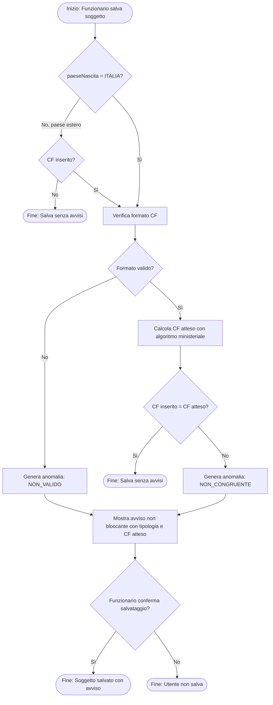
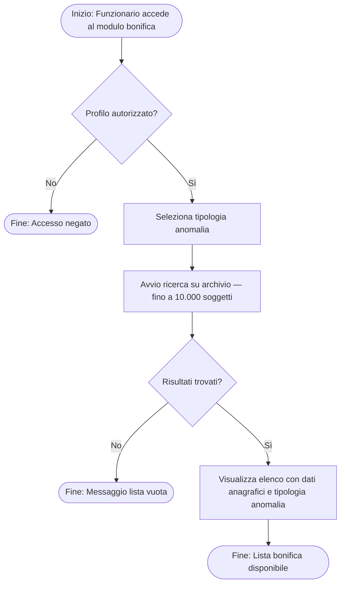
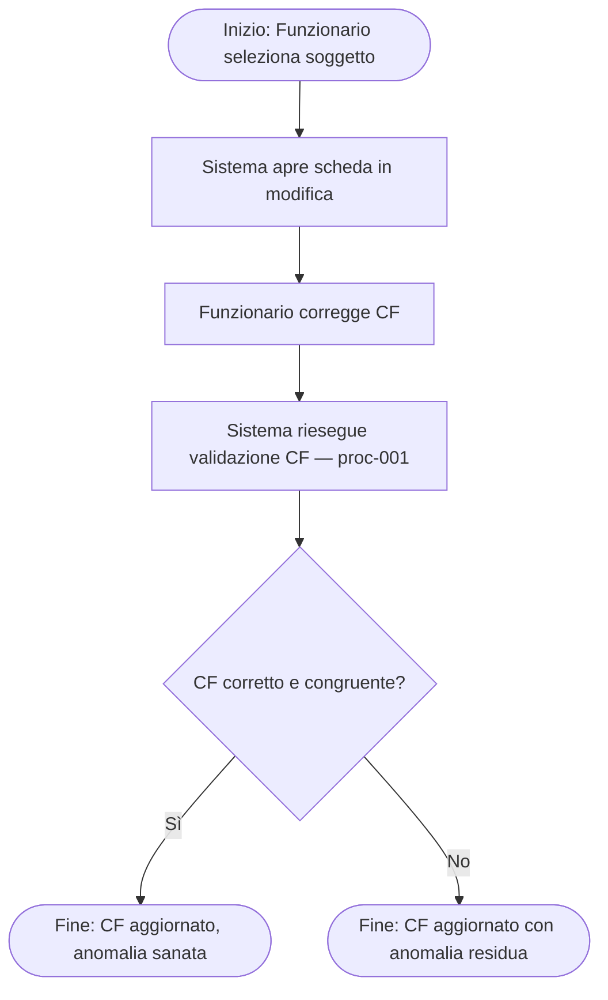
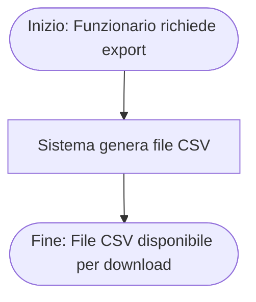

# business_processes

## process_catalog

| process_id | process_name | process_type | process_description | trigger | actors | input_entities | output_entities | related_requirement_ids |
|---|---|---|---|---|---|---|---|---|
| proc-001 | Validazione CF in Inserimento/Modifica Soggetto | Core | Verifica obbligatorietà condizionata, formato e congruenza del CF al salvataggio di un soggetto. Produce avviso non bloccante se rileva anomalie. | Il funzionario avvia il salvataggio di un soggetto (inserimento o modifica). | role-001 | ent-001, ent-002 | ent-004, ent-003 | FR-001, FR-002, FR-003, FR-004, FR-005, FR-006, FR-007, UC-001, UC-002 |
| proc-002 | Ricerca Soggetti con Anomalia CF (Bonifica) | Supporting | Il funzionario autorizzato seleziona la tipologia di anomalia CF e avvia la ricerca sull'intero archivio. Restituisce elenco soggetti con tipologia anomalia. | Il funzionario accede al modulo bonifica e seleziona una tipologia di ricerca. | role-002 | ent-001 | ent-005, ent-006 | FR-008, FR-009, FR-010, UC-003 |
| proc-003 | Correzione CF di Soggetto dalla Lista Bonifica | Core | Il funzionario seleziona un soggetto dall'elenco bonifica, apre la scheda, corregge il CF e salva. Il sistema riesegue la validazione CF. | Il funzionario seleziona un soggetto dalla lista bonifica. | role-002 | ent-006, ent-001, ent-002 | ent-001, ent-004 | FR-011, FR-001÷006, UC-004 |
| proc-004 | Esportazione Lista Bonifica in CSV | Supporting | Il funzionario richiede l'esportazione dell'elenco bonifica corrente in formato CSV. Il sistema genera il file con dati anagrafici e tipologia anomalia. | Il funzionario seleziona l'azione di esportazione dalla lista bonifica. | role-002 | ent-005, ent-006 | File CSV esportato | FR-012, UC-005 |

## process_steps

| process_id | step_id | step_order | step_name | step_description | step_type | actor | decision_condition |
|---|---|---|---|---|---|---|---|
| proc-001 | step-001 | 1 | Inizio compilazione soggetto | Il funzionario apre la scheda soggetto in modalità inserimento o modifica. | Start | role-001 | |
| proc-001 | step-002 | 2 | Verifica obbligatorietà CF | Il sistema valuta se paeseNascita = ITALIA. | Decision | System | Se paeseNascita=ITALIA → CF obbligatorio; altrimenti → CF facoltativo |
| proc-001 | step-003a | 3 | Soggetto straniero senza CF | Se paese≠ITALIA e CF assente: il sistema salva senza avvisi e termina. | End | System | |
| proc-001 | step-003b | 3 | Verifica formato CF | Se paese=ITALIA o CF presente: il sistema verifica il formato (16 char, struttura, check digit). | Action | System | |
| proc-001 | step-004 | 4 | CF valido formalmente? | Il sistema valuta l'esito della verifica formale. | Decision | System | Se formato valido → calcola CF atteso; se non valido → genera AnomaliaCodiceFiscale(NON_VALIDO) |
| proc-001 | step-005 | 5 | Calcolo CF atteso | Il sistema calcola il CF atteso tramite algoritmo ministeriale dai dati anagrafici del soggetto. | Action | System | |
| proc-001 | step-006 | 6 | Confronto CF inserito vs CF atteso | Il sistema confronta CF inserito con CF atteso (case-insensitive). | Decision | System | Se congruente → salva senza avvisi; se non congruente → genera AnomaliaCodiceFiscale(NON_CONGRUENTE) |
| proc-001 | step-007 | 7 | Generazione avviso non bloccante | Il sistema genera un avviso con tipologia anomalia e CF atteso. Il funzionario visualizza l'avviso. | Action | System | |
| proc-001 | step-008 | 8 | Salvataggio soggetto | Il funzionario conferma il salvataggio (con o senza avviso). Il sistema salva il soggetto. | End | role-001 | |
| proc-002 | step-001 | 1 | Accesso modulo bonifica | Il funzionario con accesso bonifica accede al modulo di ricerca archivi. | Start | role-002 | |
| proc-002 | step-002 | 2 | Selezione tipologia anomalia | Il funzionario seleziona la tipologia: ASSENTE, NON_VALIDO, NON_CONGRUENTE. | Action | role-002 | |
| proc-002 | step-003 | 3 | Avvio ricerca | Il sistema esegue la ricerca sull'intero archivio. | Action | System | |
| proc-002 | step-004 | 4 | Visualizzazione risultati | Il sistema restituisce l'elenco soggetti con anomalia. | End | System | |
| proc-003 | step-001 | 1 | Selezione soggetto da lista bonifica | Il funzionario seleziona un soggetto dalla lista bonifica con azione singola. | Start | role-002 | |
| proc-003 | step-002 | 2 | Apertura scheda soggetto | Il sistema apre la scheda soggetto in modalità modifica. | Action | System | |
| proc-003 | step-003 | 3 | Correzione CF | Il funzionario corregge il campo CF nella scheda. | Action | role-002 | |
| proc-003 | step-004 | 4 | Salvataggio e ri-validazione | Il sistema riesegue il processo di validazione CF (proc-001, step-002÷008). | Action | System | |
| proc-003 | step-005 | 5 | Esito correzione | Se CF corretto e congruente: soggetto non compare più nella lista bonifica per quell'anomalia. | End | System | |
| proc-004 | step-001 | 1 | Richiesta esportazione | Il funzionario seleziona l'azione di esportazione dalla lista bonifica corrente. | Start | role-002 | |
| proc-004 | step-002 | 2 | Generazione CSV | Il sistema genera il file CSV con tutti i soggetti dell'elenco e la tipologia anomalia. | Action | System | |
| proc-004 | step-003 | 3 | Download file | Il file CSV è disponibile per il download. | End | role-002 | |

## process_flow_diagrams

### proc-001: Validazione CF in Inserimento/Modifica Soggetto

### proc-002: Ricerca Soggetti con Anomalia CF

### proc-003: Correzione CF dalla Lista Bonifica

### proc-004: Esportazione Lista Bonifica

PROCESSES_COMPLETED