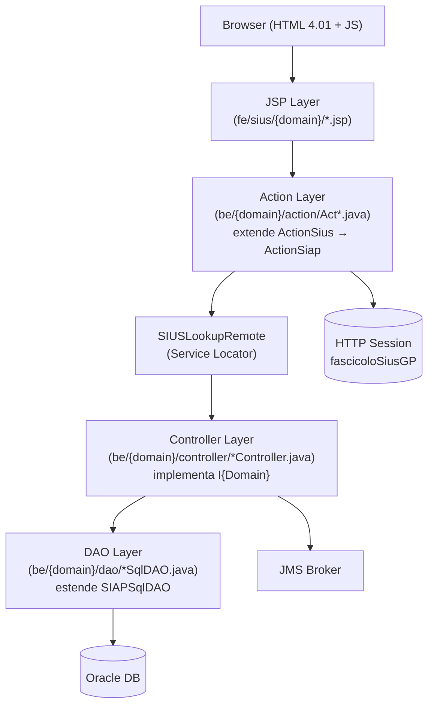

# Deep Dive - Progetto SIUS

**Data Analisi**: 2026-04-24  
**Versione Codebase**: frammento sorgente (nessun tag Git disponibile — repository SVN)

---

## 1. Executive Summary

SIUS (Sistema Informativo Uffici di Sorveglianza) è un modulo del sistema SIAP del Ministero della Giustizia italiano, dedicato alla gestione dei procedimenti penali di sorveglianza (fascicoli, udienze, misure alternative/sicurezza, titoli esecutivi, etc.). Il codebase è un **frammento di sorgenti Java/JSP** senza build system autonomo: viene integrato nell'EAR/WAR SIAP durante l'assemblaggio. Il progetto è significativo per dimensioni (~395.000 SLOC totali, 1.294 classi Java, 670 JSP), altamente legacy (Java senza annotazioni moderne, framework F3B proprietario degli anni 2000, SQL concatenato a stringa, encoding misto ISO-8859/UTF-8) e privo di test automatici visibili. Il tech debt è elevato e una strategia di refactoring strutturato è fortemente consigliata prima di qualsiasi modernizzazione.

---

## 2. Project Structure

### 2.1 Repository Organization

```
SIUS/
├── be/                          # Backend Java (package root: siap.sius.*)
│   ├── ActionSius.java          # Base class per tutte le action SIUS
│   ├── SIUSException.java       # Eccezione radice del modulo
│   ├── util/
│   │   └── SIUSLookupRemote.java  # Service Locator centralizzato
│   └── {domain}/                # 49 moduli di dominio (es. fascicolo, udienza, ...)
│       ├── action/              # Layer HTTP (processRequest)
│       ├── controller/          # Business logic (Ex* methods)
│       ├── dao/                 # Data access (SQL string concat)
│       └── model/               # DTO / data carrier
├── fe/
│   └── sius/                    # JSP frontend (specchio dei domini be/)
│       └── {domain}/            # ~40 aree funzionali
└── .github/
    └── copilot-instructions.md
```

**Struttura**: source-only fragment — nessun `pom.xml`, nessun `package.json`, nessun file di configurazione runtime. Il progetto è un **multi-module source tree** assemblato esternamente nella piattaforma SIAP.

### 2.2 Build Artifacts

- Nessun build system locale rilevato.
- Il progetto produce classi Java compilate e JSP che vengono incluse nel WAR/EAR del sistema SIAP madre.
- Build presumibilmente gestito tramite Maven nella root SIAP (non incluso in questo repository).

### 2.3 Branching Strategy

- Version control: **SVN** (come evidenziato dai commenti nel codice tipo `release_12.9.2.0`).
- Git non è configurato per questo repository.

---

## 3. Technology Stack

### 3.1 Backend Stack

| Categoria | Tecnologia | Versione stimata | Note |
|-----------|------------|-----------------|------|
| Language | Java | ≤ 1.8 (pre-generics widespread) | Raw types `Vector`, nessuna lambda |
| Framework Web | F3B (proprietario Bull/Atos) | N/A | `ActionSiap` → `ActionSius`, non Struts/Spring |
| Persistence | JDBC diretto + SIAPSqlDAO | N/A | SQL concatenato a stringa, nessun ORM |
| Logging | Apache Log4j 1.x | ~1.2.x | `Logger.getLogger(LogF3B.SIES_LOG)` |
| Messaging | JMS (tramite JMSLookupRemote) | N/A | `TrasmissioneJMSController` |
| Build tool | Maven (in root SIAP) | N/A | Nessun pom.xml locale |
| Security | F3B session-based | N/A | `getCodUtenteConnesso()`, `getCodUfficioUtenteConnesso()` |
| Locking | LockController (proprietario) | N/A | Lock applicativo su fascicoloSiusGP |

### 3.2 Frontend Stack

| Categoria | Tecnologia | Versione | Note |
|-----------|------------|----------|------|
| View engine | JSP + JSTL | 2.x / 1.2 | Scriptlet `<% %>` inline |
| CSS | Proprietario SIAP | N/A | `IWebConstants.PG_STYLE` |
| JavaScript | Vanilla JS | ES3/ES5 | Script legacy inline, `language="JavaScript"` |
| HTML | HTML 4.01 Transitional | — | `<!DOCTYPE HTML PUBLIC "-//W3C//DTD HTML 4.01 Transitional//EN">` |

### 3.3 Database & Persistence

| Categoria | Tecnologia | Versione | Note |
|-----------|------------|----------|------|
| RDBMS | Oracle (inferito) | N/A | `BigDecimal` per PK, sequence-based ID, pattern tipico Oracle |
| Connection | `getDBTransaction()` / `closeDBTransaction()` | — | Connection pooling gestito da SIAP padre |
| SQL | Stringa concatenata | — | 3.190 occorrenze `lStatement +=` |
| Schema mgmt | Nessuno rilevato | — | Nessun Flyway/Liquibase visibile |
| Cache | Nessuna rilevata | — | Nessuna cache layer applicativa |

### 3.4 Infrastructure & DevOps

| Categoria | Tecnologia | Note |
|-----------|------------|------|
| App server | JBoss / Tomcat (SIAP) | Inferito da `jboss-deployment-structure.xml` nella root SIAP |
| VCS | SVN | Nessun `.git` directory |
| CI/CD | N/A (nessun pipeline visibile) | — |
| Monitoring | Nessuno rilevato | Nessun health check, nessun actuator |
| Containerization | Nessuna | Deployment on-premise tradizionale |

---

## 4. Architecture Overview

### 4.1 Application Architecture Pattern

**Pattern**: Monolith modulare a 4 layer, architettura MVC tradizionale (pre-framework moderni).



### 4.2 Communication Patterns

- **Sincrono**: HTTP request/response tra JSP e Action (form POST/GET tradizionali)
- **Asincrono**: JMS tramite `TrasmissioneJMSController` (notifiche al modulo Avvocatura)
- **Integrazione esterna**:
  - `siap.sico.*` — modulo comune SICO (soggetto, ufficio, decodifiche, sicurezza)
  - `siap.siep.*` — modulo SIEP (fascicolo SIEP, sentenze)
  - `it.eng.giustizia.avvocatura.*` — modulo Avvocatura (notifiche avvisi avvocati)

### 4.3 Data Architecture

- Database singolo condiviso (Oracle), schema unico per tutta la piattaforma SIAP.
- Nessuna strategia di caching.
- Primary key via sequence Oracle (ID come `BigDecimal`).
- Stato del procedimento principale (`fascicoloSiusGP`) mantenuto in sessione HTTP — **stateful server-side**.

### 4.4 Frontend Architecture

- **MPA** (Multi Page Application) con JSP server-side rendering.
- Nessun SPA/SSR moderno.
- JavaScript limitato a validazioni client-side e `window.print()`.
- Layout tabellare HTML 4.01 Transitional.

---

## 5. Project Metrics

| Metrica | Valore | Note |
|---------|--------|------|
| Total SLOC | ~394.603 | Java + JSP |
| Backend SLOC | ~230.762 | 1.294 file `.java` |
| Frontend SLOC | ~163.841 | 670 file `.jsp` |
| Domain Modules | 49 | Cartelle sotto `be/` escludendo file root |
| Action Classes | 935 | Classi `Act*.java` (HTTP handlers) |
| Controller Classes | 42 | Business logic controllers |
| DAO Classes | 110 | Data access classes |
| Model Classes | 93 | DTO/Model classes |
| Constants Interfaces | 50 | `ICostanti*.java` |
| Classi con >1.000 LOC | ≥5 | StampaController 6.470, FascicoloSiusController 5.427, DepositoOrdinanzaPC 4.071, FascicoloSiusUDS 3.548, DepositoDecreto 3.458 |
| API Endpoints stimati | ~935 | 1 Action ≈ 1 endpoint (form POST) |
| Tabelle DB stimate | >50 | Inferite da Model/DAO naming |

---

## 6. Team & Development Process

- **VCS**: SVN (nessuna storia Git disponibile in questo repository)
- **Naming**: commenti inline con data, iniziali autore e issue ID (es. `// [FT] - 03/08/2016 - MAC_LOG`)
- **Stile commenti**: italiano e inglese misto; commenti inline abbondanti ma non standardizzati
- **Code review**: TBD (non rilevabile da sorgenti)
- **Test**: Nessuna cartella `test/` o classe di test rilevata in questo fragment
- **Quality gates**: Nessuna evidenza di SonarQube, checkstyle, o strumenti di analisi statici configurati localmente

---

## 7. Integrations & Dependencies

### 7.1 External Systems (moduli SIAP)

| Sistema | Package | Ruolo |
|---------|---------|-------|
| SICO | `siap.sico.*` | Soggetto anagrafico, ufficio, decodifiche, sicurezza utente, note, lock |
| SIEP | `siap.siep.*` | Fascicolo penale di esecuzione, sentenze, storico avvocati |
| Avvocatura | `it.eng.giustizia.avvocatura.*` | Notifiche agli avvocati (IAvvisiSius, IAvvocaturaSius) |
| JMS Broker | `siap.jms.*` | Messaggistica asincrona (presaincarico, trasmissioni) |

### 7.2 Third-Party Libraries

| Libreria | Uso | Note |
|----------|-----|------|
| Apache Log4j 1.x | Logging | EOL — vulnerabilità CVE-2019-17571 e precedenti |
| F3B Framework | Web/DAO/Exception base | Proprietario Bull/Atos, non disponibile publicamente |
| Oracle JDBC | Database | Versione N/A |

---

## 8. Security & Compliance

### 8.1 Authentication & Authorization

- **Autenticazione**: Session-based tramite F3B (`getCodUtenteConnesso()`, `getSession()`)
- **Autorizzazione**: Role-based tramite `getCodUfficioUtenteConnesso()` e tipo ufficio (`CodTipoUfficio`)
- **Lock ottimistico**: `LockController.lockIfNotLocked()` per prevenire editing concorrente sul fascicolo
- **Filtro minori**: Restrizione per tipo ufficio (`PMM`, `DIBM`, `GIPM`, `GUPM`, `CAPSM`, `TDSM`, `UDSM`)

### 8.2 Data Protection

- Nessuna evidenza di crittografia at-rest a livello applicativo.
- TLS: TBD (gestito a livello infrastrutturale, non visibile nel codice)
- **Dato sensibile**: Procedimenti penali, dati anagrafici soggetti — classificazione GDPR alta.

### 8.3 Compliance Requirements

- **GDPR**: Probabile applicazione (dati giudiziari = categoria speciale art. 9 GDPR)
- Nessun meccanismo di audit log esplicito rilevato nel codice applicativo (TBD se gestito da Oracle/SIAP)

---

## 9. Deployment & Operations

### 9.1 Deployment Target

- On-premise, server JBoss AS / JBoss EAP (inferito dalla struttura SIAP padre)
- Nessuna containerization rilevata

### 9.2 Configuration Management

- Configurazione gestita a livello di SIAP padre (non visibile in questo fragment)
- Nessun `application.yml` / `application.properties` locale

### 9.3 Monitoring & Observability

- **Logging**: Log4j 1.x, un solo appender per SIES (`LogF3B.SIES_LOG`)
- **Health check**: Nessuno rilevato
- **Metriche/APM**: Nessuna evidenza di Prometheus, Micrometer, Datadog, etc.
- **Structured logging**: Assente — logging testuale non strutturato

---

## 10. Documentation Inventory

| Documento | Path | Note |
|-----------|------|------|
| Copilot Instructions | `.github/copilot-instructions.md` | Creato in questa sessione |
| Nessun README | — | Assente nella root e nei moduli |
| Nessun Swagger/OpenAPI | — | API non documentate |
| Nessun Runbook | — | Nessuna procedura operativa |

---

## 11. Critical Observations

### 🔴 HIGH PRIORITY ISSUES

1. **Apache Log4j 1.x in uso** — EOL dal 2015, CVE-2019-17571 (Remote Code Execution via SocketServer). Da aggiornare a Log4j2 o SLF4J+Logback.
2. **SQL injection risk strutturale** — 3.190 occorrenze di SQL costruito per concatenazione di stringa (`lStatement +=`). Nessun prepared statement o parametro bind rilevato nel layer DAO.
3. **Encoding inconsistente** — 546 file Java (42%) e 392 JSP (58%) in ISO-8859-1, il resto in UTF-8. Causa problemi di caratteri accentuati in produzione e durante refactoring.
4. **Nessun test automatico** — nessuna evidenza di JUnit, Mockito o test di integrazione. Zero copertura del codice verificabile.
5. **God Classes** — `StampaController.java` (6.470 LOC), `FascicoloSiusController.java` (5.427 LOC): impossibili da testare, modificare o evolvere in sicurezza.

### 🟠 MEDIUM PRIORITY CONCERNS

1. **Raw types pervasivi** — 1.287 occorrenze di `Vector` e `Collection` senza generics. Causa `ClassCastException` a runtime non rilevabili a compile time.
2. **`catch(Exception e)` generico** — 1.127 occorrenze: oscura la gestione errori, ingoia eccezioni inattese silenziosamente.
3. **602 commenti TODO/STUB/FIXME** — indicano funzionalità incomplete o workaround non risolti.
4. **522 `@SuppressWarnings`** — segnale di soppressione sistematica di problemi di qualità piuttosto che risoluzione.
5. **State HTTP in sessione come unico store** — `fascicoloSiusGP` referenziato 509 volte: qualsiasi problem di sessione (timeout, failover) provoca perdita di stato silente.
6. **Nessuna cache applicativa** — ogni operazione colpisce il DB Oracle senza alcun layer di caching, potenziale bottleneck sotto carico.

### 🟢 POSITIVE FINDINGS

1. **Pattern architetturale consistente** — tutti i 49 moduli rispettano la stessa struttura `action/controller/dao/model`, facilitando la navigazione e il refactoring modulare.
2. **Lock applicativo esplicito** — `LockController` previene editing concorrente, buona pratica per un'applicazione multi-utente stateful.
3. **Service Locator centralizzato** — `SIUSLookupRemote` è il punto unico di accesso ai controller, facilitando un futuro DI injection.
4. **Constants interfaces** — 50 `ICostanti*.java` centralizzano i nomi dei campi, riducendo magic strings sparse.

---

## 12. Technology Radar

### 🚨 EOL/Deprecated Technologies

| Tecnologia | EOL | Impatto | Azione |
|------------|-----|---------|--------|
| Apache Log4j 1.x | 2015 | CRITICO (CVE attive) | Migrare a SLF4J + Logback |
| HTML 4.01 Transitional | 2014 | ALTO (accessibilità, sicurezza) | Migrare a HTML5 |
| JSP + Scriptlet `<% %>` | Deprecato (best practice) | MEDIO | Eliminare scriptlet inline |
| `java.util.Vector` raw | Legacy Java 1.0 | MEDIO | Sostituire con `List<T>` |

### ⚠️ Near EOL / Rischio

| Tecnologia | Stato | Note |
|------------|-------|------|
| Java pre-8 (stile) | Superato | Nessun uso di lambda, stream, Optional — aggiornare stile a Java 11/17 |
| F3B Framework | Proprietario/inattivo | Nessuna community, nessun aggiornamento: rischio dipendenza vendor |
| Session-based state | Anti-pattern moderno | Ostacola scalabilità orizzontale e cloud-readiness |

### ✅ Current

| Tecnologia | Note |
|------------|------|
| Oracle RDBMS | Standard per PA italiana, supportato |
| JMS | Ancora valido per messaging asincrono |

---

## 13. Next Steps (PRE-REFACTORING pipeline)

Sulla base di questa analisi, i prossimi step PRE-REFACTORING sono:

1. **HOW_06** — Software Architecture: C4 Level 3 e deployment diagram
2. **HOW_07** — Code Implementation Details: pattern dominanti e hotspot
3. **HOW_08** — Data Architecture: schema ER e data flows
4. **HOW_13** — Decision Log: ADR delle scelte architetturali chiave
5. **HOW_14** — Metrics: quality gates e metriche dettagliate
6. **HOW_ANTIPATTERN** — Antipattern Deep Dive: inventario completo tech debt
7. **HOW_BE** — Backend Deep Assessment: health score e priorità intervento
8. **HOW_FP_COCOMO** — Effort estimation per la modernizzazione

---

## Appendix A: Tool Commands Used

```bash
# Lines of code
find be -name "*.java" | xargs cat | wc -l
find fe -name "*.jsp" | xargs cat | wc -l

# File counts
find be -name "*.java" | wc -l
find fe -name "*.jsp" | wc -l

# Architecture class counts
find be -name "Act*.java" | wc -l          # Action classes
find be -name "*Controller.java" | wc -l   # Controller classes
find be -name "*DAO*.java" | wc -l         # DAO classes
find be -name "*Model.java" | wc -l        # Model classes
find be -name "ICostanti*.java" | wc -l    # Constants interfaces

# SQL risk
grep -r "lStatement +=" be/ --include="*.java" | wc -l

# Encoding check
find be -name "*.java" | xargs file | grep -c "ISO-8859"

# God classes
find be -name "*.java" -exec wc -l {} \; | sort -rn | head -10

# Session coupling
grep -r "getSessionAttribute\|setSessionAttribute" be/ --include="*.java" | grep -oP '"[^"]+"' | sort | uniq -c | sort -rn

# Raw types
grep -r "new Vector\b\|Vector " be/ --include="*.java" | wc -l
```

## Appendix B: File Paths Reference

```
Backend:
  - Base action class:    be/ActionSius.java
  - Base exception:       be/SIUSException.java
  - Service locator:      be/util/SIUSLookupRemote.java
  - Largest class:        be/stampa/controller/StampaController.java (6470 LOC)
  - Core business:        be/fascicolo/controller/FascicoloSiusController.java (5427 LOC)
  - Domain example:       be/fascicolo/ (action, controller, dao, model)

Frontend:
  - JSP root:             fe/sius/
  - Example domain JSP:   fe/sius/fascicolo/RicercaFascicolo.jsp

Infra:
  - No pom.xml in fragment
  - No application.yml/properties
  - Copilot instructions: .github/copilot-instructions.md
```