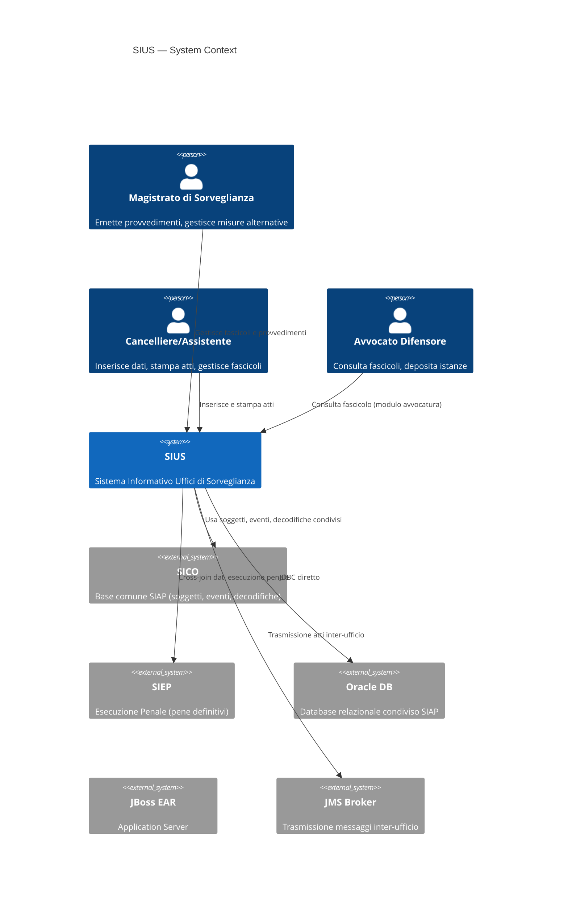

# Context — Progetto SIUS

**Data**: 2026-04-24  
**Versione**: 1.0  
**Autori**: IMPACT AI Agent  
**Audience**: Stakeholder tecnici e non tecnici, management, team di sviluppo

---

## 1. Di cosa tratta questo progetto?

### 1.1 Dominio applicativo

**SIUS** (Sistema Informativo Uffici di Sorveglianza) è un sistema informativo del **Ministero della Giustizia italiano**, appartenente alla piattaforma SIAP (Sistema Informativo Automatizzato Penale). Opera nel settore **public sector / giustizia penale** per la gestione dell'esecuzione penale presso gli **Uffici di Sorveglianza** del territorio nazionale.

### 1.2 Purpose Statement

> SIUS è il sistema informatico che supporta i magistrati di sorveglianza e il personale degli uffici giudiziari nella gestione dell'esecuzione della pena per i condannati definitivi. Consente la gestione del fascicolo del detenuto/sorvegliato, l'emissione di provvedimenti (ordinanze, decreti, sentenze), la gestione delle misure alternative alla detenzione, il coordinamento con gli istituti penitenziari e le trasmissioni inter-ufficio.

### 1.3 Tipo di sistema

**B2G (Business-to-Government)** — sistema interno alla Pubblica Amministrazione:
- Utenti: magistrati, cancellieri, assistenti giudiziari degli Uffici di Sorveglianza
- Titolare: Ministero della Giustizia — Direzione Generale dei Sistemi Informativi Automatizzati (DGSIA)
- Deployment: intranet giustizia (non accessibile da Internet pubblico)

### 1.4 Acronimo e naming

| Acronimo | Significato |
|---------|-------------|
| SIUS | Sistema Informativo Uffici di Sorveglianza |
| SIAP | Sistema Informativo Automatizzato Penale (EAR contenitore) |
| SICO | Sottosistema base SIAP (Soggetto, Fascicolo, Evento) |
| SIEP | Sistema Informativo Esecuzione Penale (modulo pene definitive) |
| UDS | Ufficio di Sorveglianza |

---

## 2. Scope del Sistema

### 2.1 In Scope

- **Gestione fascicolo sorveglianza**: apertura, modifica, storico, chiusura del fascicolo personale del condannato/sorvegliato
- **Provvedimenti giudiziari**: inserimento e gestione di ordinanze (LA, CIMA, UDS), decreti, sentenze, impugnazioni
- **Misure alternative alla detenzione**: gestione misure di sicurezza (CIMA), misure alternative, esecuzione sanzioni sostitutive
- **Udienza e calendario**: gestione udienze, fissazione, verbali, rinvii
- **Trasmissione atti**: trasmissione JMS verso altri uffici e sistemi (inter-ufficio)
- **Stampa provvedimenti**: generazione PDF di ordinanze, decreti, sentenze, verbali
- **Statistiche**: report statistici per il Ministero
- **Avvocatura**: funzioni per gli avvocati difensori (sotto-modulo)
- **Prescrizione**: calcolo e gestione prescrizioni
- **Ricerca**: ricerca fascicoli per soggetto, tipo reato, anno, ufficio

### 2.2 Out of Scope

- Pagamenti e contabilità (gestito da sistema contabile separato del Ministero)
- Gestione HR del personale giudiziario (sistema HR SIAP separato)
- Registro generalità detenuti in carcere (gestito da SIGE — istituti penitenziari)
- Sistema informativo del casellario giudiziario (SIES — sistema separato)
- Portale servizi per i cittadini (accesso giustiziano)
- Gestione udienze penali di primo grado (competenza del giudice monocratico/collegiale)

### 2.3 System Boundaries



---

## 3. Come si inserisce nell'ambiente esistente

### 3.1 Processo Business supportato

| Aspetto | Valore |
|---------|--------|
| Processo | Esecuzione della pena — fase di sorveglianza post-condanna |
| Criticità | **Mission-critical**: blocco del sistema = impossibilità di emettere provvedimenti giudiziari |
| Frequenza | Quotidiano — attività continua degli uffici di sorveglianza (~165 sedi in Italia) |
| Impatto se down | Operatori non possono registrare provvedimenti, stampe bloccate, udienze non gestibili |
| Utenti stimati | ~3.000-5.000 utenti (magistrati, cancellieri, assistenti su tutto il territorio nazionale) |

### 3.2 Landscape Sistemico

**Sistemi upstream (da cui riceve dati):**
- **SIEP**: dati sulla pena definitiva del condannato (sentenza, tipo reato, durata pena)
- **SICO**: anagrafica soggetto (nome, cognome, data nascita, residenza)
- **Istituti penitenziari**: comunicazioni ingresso/uscita (via JMS o flusso batch)

**Sistemi downstream (a cui invia dati):**
- **JMS broker**: trasmissione atti e messaggi verso altri uffici di sorveglianza e procura
- **Sistemi di stampa**: generazione PDF provvedimenti
- **Archivio**: archiviazione fascicoli chiusi

### 3.3 Integrazione nella piattaforma SIAP

```
SIAP EAR (JBoss Application Server)
├── SICO   — base comune (soggetti, eventi, decodifiche, utenti)
├── SIEP   — esecuzione penale
├── SIUS   — sorveglianza (questo sistema)
│   ├── be/ — business layer (Java, ~1.294 classi)
│   └── fe/ — view layer (JSP, ~670 view)
└── Altri moduli (SIGE, casellario, ...)
         ↓
    Oracle DB (schema condiviso)
```

---

## 4. Utenti e Ruoli

| Ruolo | Descrizione | Funzionalità principali |
|-------|------------|------------------------|
| **Magistrato di Sorveglianza** | Giudice competente | Emissione ordinanze, decreti, sentenze; gestione udienza |
| **Cancelliere** | Personale amministrativo | Apertura fascicoli, inserimento atti, stampa |
| **Assistente Giudiziario** | Supporto cancelleria | Ricerca fascicoli, data entry |
| **Avvocato Difensore** | Difensore del condannato | Consultazione fascicolo (modulo avvocatura) |
| **Statistiche/Reporting** | Ufficio statistiche Ministero | Accesso ai report statistici |
| **Amministratore** | DGSIA | Gestione utenti, configurazione |

---

## 5. Criticità e Contesto Normativo

| Normativa | Rilevanza per SIUS |
|----------|-------------------|
| **D.Lgs. 230/1999** | Ordinamento penitenziario — base normativa per le misure alternative |
| **D.Lgs. 106/2018** | Accessibilità PA (AGID) — obblighi WCAG 2.1 |
| **GDPR (Reg. EU 679/2016)** | Dati sensibili dei condannati (dati giudiziari = dati sensibili ex art. 9) |
| **CAD (D.Lgs. 82/2005)** | Codice dell'Amministrazione Digitale — obblighi PA digitale |
| **Legge 241/1990** | Procedimento amministrativo — tracciabilità degli atti |

---

## 6. Elevator Pitch

> **Per** i magistrati e il personale degli Uffici di Sorveglianza del Ministero della Giustizia,  
> **SIUS** è un sistema di gestione informatica dell'esecuzione penale,  
> **che** consente la gestione completa dei fascicoli dei condannati, l'emissione di provvedimenti giudiziari, la gestione delle misure alternative alla detenzione e la trasmissione telematica degli atti tra uffici,  
> **a differenza di** la gestione cartacea manuale precedente,  
> **SIUS** garantisce tracciabilità, ricercabilità e produzione automatica di documenti ufficiali nel rispetto delle norme dell'ordinamento penitenziario italiano.

---

## Reference Documents

- **Deep Dive Analysis**: `docs/00_deep_dive.md`

---

## Change Log

| Versione | Data | Autore | Modifiche |
|----------|------|--------|-----------|
| 1.0 | 2026-04-24 | IMPACT AI Agent | Prima versione — context ricostruito da analisi codebase |