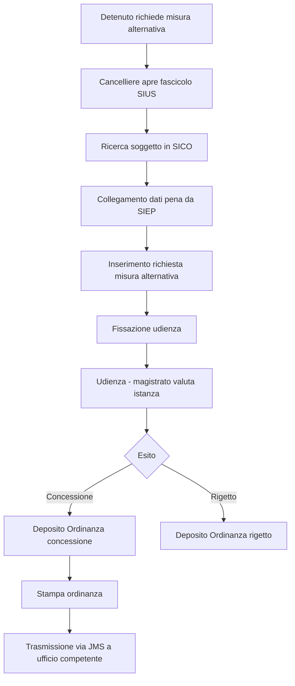
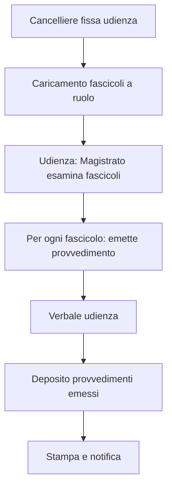
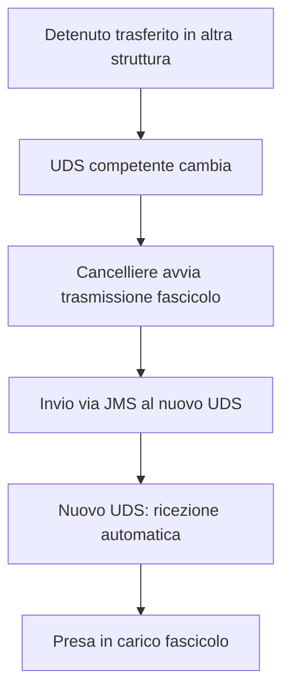

# Functional Overview — Progetto SIUS

**Data**: 2026-04-24  
**Versione**: 1.0  
**Autori**: IMPACT AI Agent  
**Audience**: Product owner, Analisti funzionali, Team di sviluppo

---

## 1. Introduzione

Questo documento descrive le funzionalità del sistema SIUS (Sistema Informativo Uffici di Sorveglianza) organizzate per personas utente, domini funzionali, casi d'uso principali e flussi utente rilevanti.

L'analisi è ricostruita **bottom-up** dall'esame del codice sorgente (935 Action classes, 51 moduli funzionali).

---

## 2. Personas Utente

### 2.1 Magistrato di Sorveglianza

| Attributo | Dettaglio |
|-----------|-----------|
| **Ruolo** | Giudice monocratico specializzato nell'esecuzione della pena |
| **Obiettivo** | Emettere provvedimenti (ordinanze, decreti, sentenze), gestire le udienze |
| **Competenza tecnica** | Bassa — funzionalità tramite interfaccia semplice |
| **Frequenza uso** | Quotidiano |
| **Frustrazione principale** | Lentezza nelle ricerche, molteplicità di schermate per completare un atto |

**Azioni tipiche:**
- Consulta fascicolo del sorvegliato prima dell'udienza
- Emette ordinanza di concessione/revoca misura alternativa
- Firma digitalmente (o cartaceamente) i provvedimenti prodotti

### 2.2 Cancelliere / Assistente Giudiziario

| Attributo | Dettaglio |
|-----------|-----------|
| **Ruolo** | Personale amministrativo dell'ufficio |
| **Obiettivo** | Gestire i fascicoli, registrare gli atti, stampare i documenti |
| **Competenza tecnica** | Media — utente abituale del sistema |
| **Frequenza uso** | Quotidiano — attività primaria del lavoro |
| **Frustrazione principale** | Data entry ripetitivo, navigazione a tante schermate, assenza di validazione lato client |

**Azioni tipiche:**
- Apre un nuovo fascicolo per un condannato
- Inserisce la richiesta di misura alternativa
- Stampa ordinanza/decreto firmato
- Trasmette telematicamente atti ad altri uffici

### 2.3 Avvocato Difensore

| Attributo | Dettaglio |
|-----------|-----------|
| **Ruolo** | Difensore del condannato |
| **Obiettivo** | Consultare lo stato del fascicolo, depositare istanze |
| **Competenza tecnica** | Variabile |
| **Frequenza uso** | Saltuario (su istanza) |
| **Frustrazione principale** | Accesso limitato, schermate non intuitive |

**Azioni tipiche (modulo `be/avvocatura/`, `be/avvocato/`):**
- Consultazione fascicolo sorveglianza
- Deposito istanze per il proprio assistito
- Verifica stato provvedimento

### 2.4 Amministratore DGSIA

| Attributo | Dettaglio |
|-----------|-----------|
| **Ruolo** | Gestione del sistema a livello centrale |
| **Obiettivo** | Configurare il sistema, gestire utenti, decodifiche |
| **Competenza tecnica** | Alta |
| **Frequenza uso** | Saltuario |

---

## 3. Domini Funzionali e Catalogo Casi d'Uso

Il sistema è organizzato in **51 moduli** con una corrispondenza 1:1 tra package Java e dominio funzionale. Di seguito l'inventario completo con numero di Action classes come proxy di complessità.

### 3.1 Gestione Fascicolo (87 actions)

`be/fascicolo/`

| ID | Caso d'Uso | Descrizione |
|----|-----------|-------------|
| UC-01 | Ricerca fascicolo | Ricerca per soggetto, tipo procedimento, anno, ufficio |
| UC-02 | Apertura nuovo fascicolo | Creazione fascicolo sorveglianza per condannato definitivo |
| UC-03 | Consultazione fascicolo | Visualizzazione completa del fascicolo (dati personali, pena, misure) |
| UC-04 | Modifica dati fascicolo | Aggiornamento dati anagrafici e processuali |
| UC-05 | Chiusura fascicolo | Chiusura a seguito di esecuzione pena o trasferimento |

### 3.2 Richiesta Atti (173 actions — modulo più complesso)

`be/richiestaatti/`

| ID | Caso d'Uso | Descrizione |
|----|-----------|-------------|
| UC-10 | Creazione richiesta atti | Richiesta documenti ad altri uffici |
| UC-11 | Gestione iter richiesta | Aggiornamento stato (inviata, ricevuta, evasa) |
| UC-12 | Ricezione atti | Registrazione ricezione atti richiesti |
| UC-13 | Archivio richieste | Consultazione storico richieste |

### 3.3 Deposit Ordinanza Primo Collaudo (83 actions)

`be/depositoordinanzapc/`

| ID | Caso d'Uso | Descrizione |
|----|-----------|-------------|
| UC-20 | Deposito ordinanza | Registrazione ordinanza emessa dal magistrato |
| UC-21 | Modifica ordinanza | Correzione dati ordinanza |
| UC-22 | Stampa ordinanza | Generazione PDF ordinanza |
| UC-23 | Impugnazione ordinanza | Registrazione impugnazione (appello, ricorso cassazione) |

### 3.4 Udienza (51 actions)

`be/udienza/`

| ID | Caso d'Uso | Descrizione |
|----|-----------|-------------|
| UC-30 | Fissazione udienza | Calendarizzazione nuova udienza |
| UC-31 | Gestione udienza | Aggiornamento dati seduta (presenti, esito) |
| UC-32 | Verbale udienza | Redazione verbale |
| UC-33 | Rinvio udienza | Posticipo ad altra data |

### 3.5 Statistiche (55 actions)

`be/statistiche/`

| ID | Caso d'Uso | Descrizione |
|----|-----------|-------------|
| UC-40 | Report mensile | Generazione report statistici mensili |
| UC-41 | Report annuale | Aggregazione dati annuali |
| UC-42 | Estrazione dati | Export dati per il Ministero |

### 3.6 Deposito Decreto (52 actions)

`be/depositodecreto/`

| ID | Caso d'Uso | Descrizione |
|----|-----------|-------------|
| UC-50 | Deposito decreto | Registrazione decreto del magistrato |
| UC-51 | Stampa decreto | Generazione documento |

### 3.7 Misure Alternative alla Detenzione

`be/misuraalternativa/`, `be/esecuzionemisuraalternativa/`

| ID | Caso d'Uso | Descrizione |
|----|-----------|-------------|
| UC-60 | Richiesta misura alternativa | Istanza del detenuto/difensore |
| UC-61 | Concessione misura | Ordinanza di concessione |
| UC-62 | Revoca misura | Ordinanza di revoca per violazione |
| UC-63 | Esecuzione misura | Gestione del periodo di esecuzione |

### 3.8 Misure di Sicurezza

`be/misurasicurezza/`, `be/esecuzionemisuraalternativa/`, `be/misuresicurezzarichiestaatti/`

| ID | Caso d'Uso | Descrizione |
|----|-----------|-------------|
| UC-70 | Applicazione misura di sicurezza | Ordinanza di applicazione (CIMA) |
| UC-71 | Proroga misura | Rinnovo misura scaduta |
| UC-72 | Revoca misura | Fine applicazione |

### 3.9 Impugnazione (23 actions)

`be/impugnazione/`

| ID | Caso d'Uso | Descrizione |
|----|-----------|-------------|
| UC-80 | Registrazione impugnazione | Appello o ricorso avverso provvedimento |
| UC-81 | Esito impugnazione | Registrazione esito giudizio d'appello |

### 3.10 Trasmissione Atti Inter-ufficio (JMS)

`be/jms/`, `be/trasmissioneatti/`

| ID | Caso d'Uso | Descrizione |
|----|-----------|-------------|
| UC-90 | Trasmissione fascicolo | Invio fascicolo a ufficio competente |
| UC-91 | Ricezione fascicolo | Acquisizione fascicolo trasmesso |
| UC-92 | Monitoraggio trasmissioni | Verifica stato trasmissioni in coda |

### 3.11 Altri Moduli Funzionali

| Modulo | Actions | Descrizione |
|--------|---------|-------------|
| `permesso` | 22 | Gestione permessi di necessità e premi |
| `presaincarico` | 39 | Presa in carico detenuti trasferiti |
| `proscizione` | 9 | Calcolo e verifica prescrizione della pena |
| `sanzionesostitutiva` | 14 | Sanzioni sostitutive a detenzione (es. lavoro di pubblica utilità) |
| `depositosentenza` | 35 | Deposito sentenze del giudice di sorveglianza |
| `unificazione` | 9 | Unificazione pene per stesso soggetto |
| `stralcio` | — | Stralcio di procedimenti |
| `remissionedebito` | 7 | Remissione del debito (pena pecuniaria) |
| `penapecuniaria` | 7 | Gestione pena pecuniaria |
| `scadenzario` | — | Gestione scadenze e promemoria |
| `avvocatura` / `avvocato` | 24 | Funzioni difensore |
| `statistiche` | 55 | Report e statistiche ministeriali |

---

## 4. Flussi Utente Principali

### 4.1 Flusso: Apertura Fascicolo e Concessione Misura Alternativa



### 4.2 Flusso: Gestione Udienza



### 4.3 Flusso: Trasmissione Fascicolo inter-ufficio



---

## 5. Mappa Funzionale Completa

Di seguito la mappa di tutti i 51 moduli funzionali identificati:

```
SIUS — Mappa Funzionale
├── 🗂 Fascicolo e Procedimento
│   ├── fascicolo (87)          — Gestione fascicolo sorveglianza
│   ├── generaleprocedimento    — Dati generali procedimento
│   ├── iscrizioneprocedimento  — Iscrizione a ruolo
│   ├── presaincarico (39)      — Presa in carico detenuto
│   ├── cancelleriaassegnataria (8) — Assegnazione alla cancelleria
│   ├── posizionematerialefascsius  — Posizione materiale fascicolo
│   └── stralcio                — Stralcio procedimento
│
├── ⚖️ Provvedimenti
│   ├── depositoordinanzapc (83) — Ordinanze (primo collaudo/PC)
│   ├── depositodecreto (52)     — Decreti
│   ├── depositosentenza (35)    — Sentenze
│   ├── provvedimento (28)       — Provvedimenti generali
│   ├── impugnazione (23)        — Impugnazioni
│   └── decretounificazione      — Decreto di unificazione pene
│
├── 🏛 Udienza
│   ├── udienza (51)            — Gestione udienza
│   └── udienzaprocedimento (17)— Procedimenti a udienza
│
├── 🔄 Misure e Sanzioni
│   ├── misuraalternativa       — Misure alternative (semilibertà, affidamento, etc.)
│   ├── esecuzionemisuraalternativa (9) — Esecuzione misure
│   ├── misurasicurezza (25)    — Misure di sicurezza
│   ├── misuresicurezzarichiestaatti (24) — Richieste atti per misure sicurezza
│   ├── esecuzionemisuraalternativa — Esecuzione misura alternativa
│   ├── esecuzionemisurasicurezza — Esecuzione misura sicurezza
│   ├── sanzionesostitutiva (14)— Sanzioni sostitutive
│   ├── esecuzionesanzionesostitutiva (7) — Esecuzione sanzioni
│   ├── permesso (22)           — Permessi di necessità/premio
│   └── remissionedebito (7)    — Remissione debito
│
├── 📃 Richiesta Atti
│   └── richiestaatti (173)     — Gestione richieste atti (modulo più grande)
│
├── 💶 Pena Pecuniaria e Prescrizione
│   ├── penapecuniaria (7)      — Pena pecuniaria
│   ├── prescrizione (9)        — Prescrizione della pena
│   └── titoloesecutivo (7)     — Titolo esecutivo
│
├── 📄 Produzione e Stampa
│   ├── stampa                  — Stampa provvedimenti (StampaController 6470 LOC!)
│   ├── produzioneatti (13)     — Produzione atti
│   └── documentoallegato       — Allegati digitali
│
├── 🔗 Trasmissioni e Integrazione
│   ├── jms                     — Trasmissione JMS inter-ufficio
│   ├── trasmissioneatti        — Trasmissione atti
│   ├── rifasiep (6)            — Rifacimento fascicoli SIEP
│   └── rifasius                — Rifacimento fascicoli SIUS
│
├── 👤 Soggetti Correlati
│   ├── magistratorelatore (7) — Magistrato relatore
│   ├── collaboratore           — Collaboratori di giustizia
│   ├── curatore                — Curatori
│   └── esperto (10)            — Esperti (art. 80 O.P.)
│
├── 📊 Statistiche e Reporting
│   └── statistiche (55)        — Report statistici
│
├── 🔧 Utente e Tenore
│   ├── tenore (6)              — Tenore del provvedimento
│   ├── unificazione (9)        — Unificazione pene
│   ├── ulterioreistanza (7)    — Ulteriori istanze
│   ├── ulterioreistanzatenore  — Tenore istanze
│   └── scadenzario             — Scadenzario eventi
│
└── 👔 Avvocatura
    ├── avvocato (24)           — Funzioni avvocato
    └── avvocatura              — Modulo avvocatura
```

---

## 6. Copertura Funzionale per Ruolo

| Funzionalità | Magistrato | Cancelliere | Avvocato |
|-------------|:----------:|:-----------:|:--------:|
| Ricerca fascicolo | ✅ | ✅ | ✅ (limitata) |
| Gestione fascicolo | 👁 lettura | ✅ | ❌ |
| Emissione provvedimento | ✅ | ❌ | ❌ |
| Stampa provvedimento | ✅ | ✅ | ❌ |
| Trasmissione atti | ❌ | ✅ | ❌ |
| Udienza | ✅ | ✅ | ❌ |
| Statistiche | 👁 lettura | ❌ | ❌ |
| Richiesta atti | ❌ | ✅ | ❌ |
| Deposito istanze | ❌ | ❌ | ✅ |

---

## Reference Documents

- `docs/00_deep_dive.md` — Metriche tecniche complete
- `docs/01_context.md` — Contesto di sistema
- `docs/06_software_architecture.md` — Architettura software

---

## Change Log

| Versione | Data | Autore | Modifiche |
|----------|------|--------|-----------|
| 1.0 | 2026-04-24 | IMPACT AI Agent | Prima versione — funzionalità ricostruite da 935 Action classes |