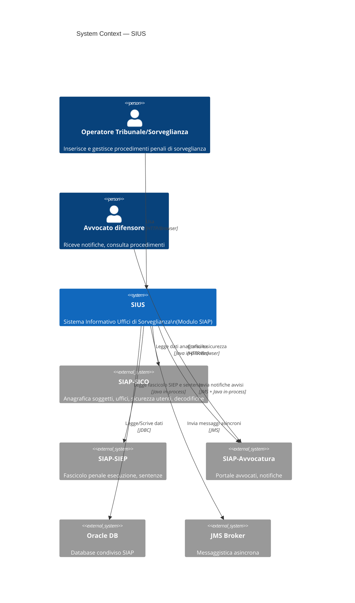
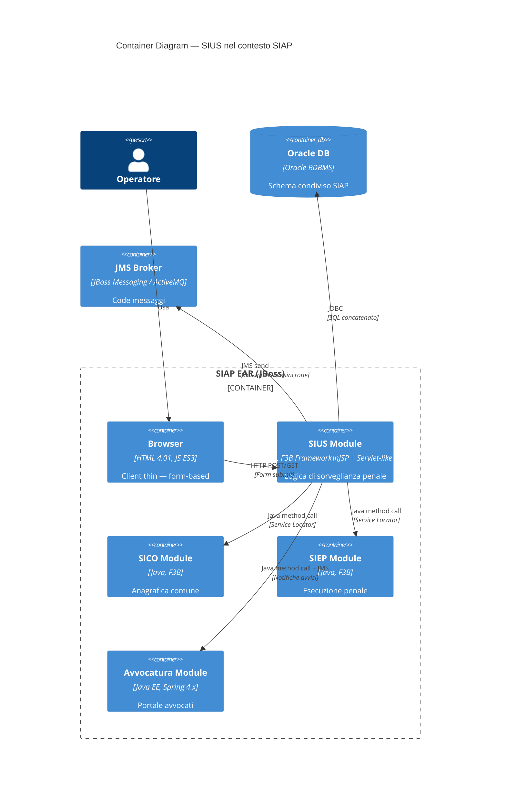
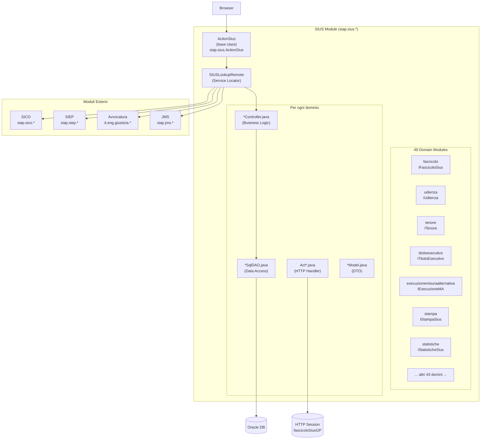
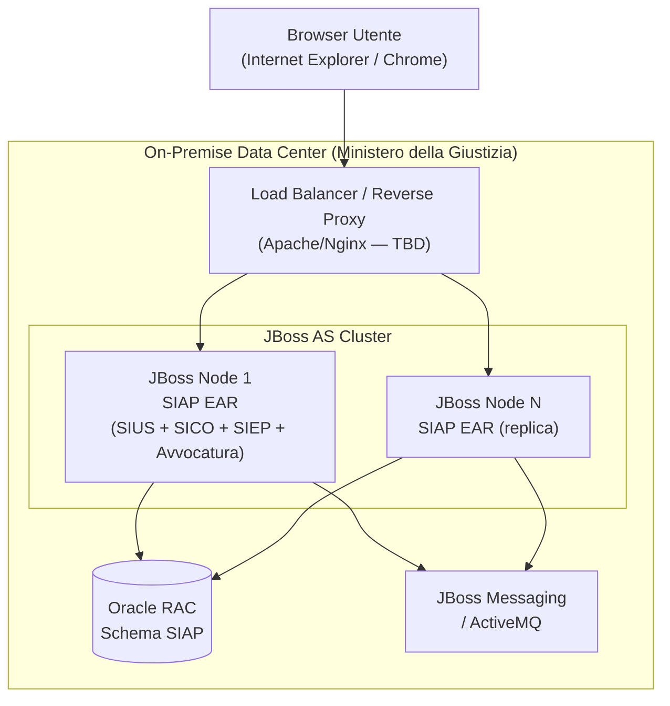
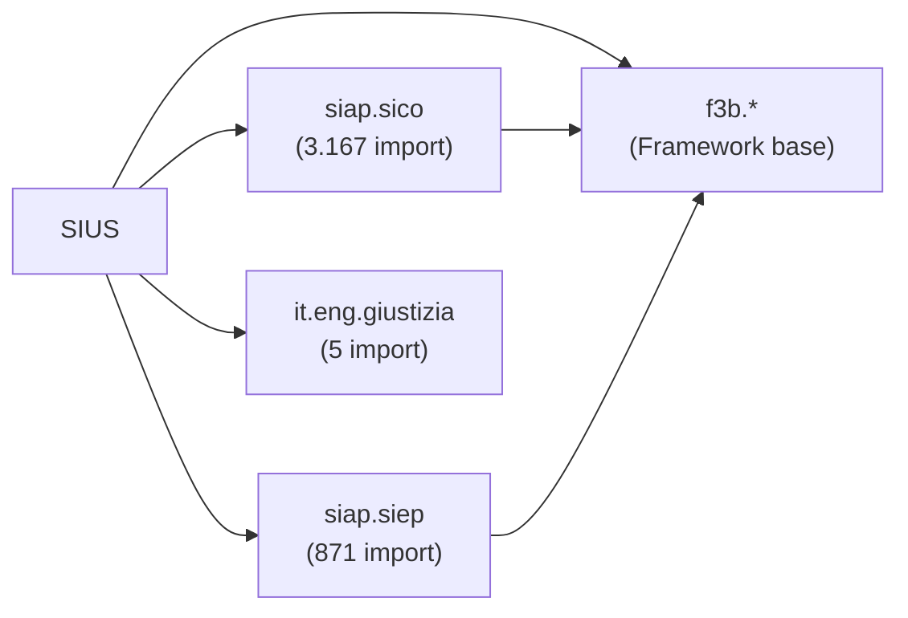

# Software Architecture - Progetto SIUS

**Data**: 2026-04-24  
**Versione**: 1.0  
**Autori**: IMPACT AI Agent  
**Audience**: Team tecnico, architetti, developer

---

## 1. Architecture Style & Patterns

### 1.1 Pattern Principale: Monolith Modulare a 4 Layer

SIUS adotta un'architettura **monolitica modulare** basata sul framework proprietario F3B (sviluppato da Bull/Atos per la piattaforma SIAP). Il pattern è un MVC tradizionale server-side con 4 layer distinti:

| Layer | Responsabilità | Tecnologia |
|-------|---------------|------------|
| **View (JSP)** | Rendering HTML, form input/output | JSP 2.x, HTML 4.01, JavaScript ES3 |
| **Action** | HTTP handler, validazione input, routing | F3B `ActionSius` → `ActionSiap` |
| **Controller** | Business logic, orchestrazione DAO, transazioni | F3B `SiapController`, interfaccia `I{Domain}` |
| **DAO** | SQL execution, mapping result set → model | F3B `SIAPSqlDAO`, SQL concatenato |

### 1.2 Service Locator Pattern

Nessun framework di dependency injection. L'accesso ai controller avviene tramite **Service Locator centralizzato** (`SIUSLookupRemote`):

```java
// Ogni action chiama:
IFascicoloSius ctrl = SIUSLookupRemote.getFascicoloSiusRemote();
// Internamente fa un lookup JNDI-like:
lRef = lookup("siap.sius.fascicolo.controller.FascicoloSiusController");
```

Il Service Locator conosce tutti i 40 controller del modulo SIUS e i controller dei moduli dipendenti (SICO, SIEP, JMS, Avvocatura).

### 1.3 Stateful Session Pattern

Il **fascicolo del procedimento** correntemente aperto è mantenuto in sessione HTTP:

```
Chiave sessione: "fascicoloSiusGP" (FascicoloGPModel)
Referenziata: 509 volte nel codebase
```

`FascicoloGPModel` è un **composite model** che aggrega:
- `FascicoloSiusModel` — dati fascicolo SIUS
- `GeneraleProcedimentoModel` — dati procedimento generale
- Sub-models di udienza, tenore, soggetto, etc.

---

## 2. Containers & Technology Choices

### 2.1 C4 Level 1 — System Context



### 2.2 C4 Level 2 — Container Diagram



---

## 3. Component Diagram (C4 Level 3 — SIUS Module)



### 3.1 Distribuzione per tipo di componente

| Tipo | Conteggio | Pattern |
|------|-----------|---------|
| Action (HTTP handler) | 935 | Estende `ActionSius`, implementa `ICostanti*` |
| Controller (business) | 42 | Estende `SiapController`, implementa `I{Domain}` |
| DAO (data access) | 110 | Estende `SIAPSqlDAO`, SQL concatenato |
| Model (DTO) | 93 | POJO con getter/setter |
| Constants Interface | 50 | Costanti `CAMPO_*` per HTTP params |

### 3.2 Domini senza Controller dedicato (action-only)

10 domini non hanno un `controller/` locale ma utilizzano i controller di altri moduli:
`avvocatura`, `iscrizioneprocedimento`, `luogodetenzione`, `misuraalternativa`, `misuresicurezzarichiestaatti`, `penapecuniaria`, `presaincarico`, `produzioneatti`, `provvedimento`, `ulterioreistanzatenore`

---

## 4. Deployment Diagram



> **Nota**: la configurazione infrastrutturale esatta è TBD — non sono presenti file di deployment o configurazione infrastrutturale in questo fragment.

---

## 5. Integration Architecture

### 5.1 Dipendenze In-Process (compile-time)



Dipendenze per numero di import:
- `siap.sico.*` — **3.167 import** (modulo più accoppiato)
- `siap.siep.*` — **871 import**
- `it.eng.giustizia.*` — **5 import** (integrazione Avvocatura recente)

### 5.2 Dipendenze Asincrone (JMS)

Il modulo `jms/` gestisce la trasmissione asincrona di eventi:
- **TrasmissioneJMSController** (`ITrasmissioneJMS`) — invio eventi a code JMS
- Usato per: notifiche al modulo Avvocatura, presaincarico, trasmissione atti
- Pattern: fire-and-forget (nessun reply handler rilevato)

### 5.3 Avvocatura Integration

Il sub-modulo `avvocatura/` (package `siap.sius.avvocatura.*`) coordina:
- `ICostantiAvvisiAvvocato`: tipi di evento (FISSAZIONE_UDIENZA, RINVIO_UDIENZA, EMISSIONE_DECRETO, etc.)
- `AvvisiAvvocatoDAO` / `AvvisiAvvocatoSqlDAO`: persistenza degli avvisi
- Notifiche triggered da azioni SIUS su udienze, decreti, ordinanze

---

## 6. Architectural Risks Mitigation

### 6.1 Rischi identificati e raccomandazioni

| Rischio | Gravità | Descrizione | Mitigazione Raccomandata |
|---------|---------|-------------|--------------------------|
| **Session single point of failure** | ALTA | `fascicoloSiusGP` in sessione HTTP: failover di nodo = perdita stato utente | Introdurre session replication JBoss o externalizzare stato (Redis/DB) |
| **SQL injection** | ALTA | 3.190 SQL costruiti per concatenazione, nessun prepared statement | Refactoring progressivo a parametri bind; scanner SAST immediato |
| **God classes** | ALTA | StampaController (6.470 LOC), FascicoloSiusController (5.427 LOC) | Decomposizione per responsabilità — almeno 3-5 classi ciascuna |
| **Zero test coverage** | ALTA | Nessun test automatico: ogni modifica è rischiosa | Introdurre JUnit per controller; mock DAO; partire dai componenti stabili |
| **Log4j 1.x CVE** | CRITICA | EOL 2015, CVE-2019-17571 | Upgrade a SLF4J + Logback immediatamente |
| **Coupling SICO altissimo** | MEDIA | 3.167 import: ogni cambio API SICO può rompere SIUS | Introdurre Anti-Corruption Layer o facade per SICO |
| **No health check** | MEDIA | Impossibile rilevare nodi in stato anomalo | Esporre endpoint `/health` JBoss o custom servlet |

---

## Reference Documents

- **Deep Dive Analysis**: `docs/00_deep_dive.md`

---

## Change Log

| Versione | Data | Autore | Modifiche |
|----------|------|--------|-----------|
| 1.0 | 2026-04-24 | IMPACT AI Agent | Creazione documento iniziale |