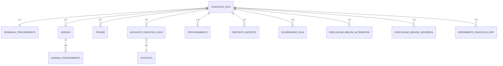

# Data Architecture - Progetto SIUS

**Data**: 2026-04-24  
**Versione**: 1.0  
**Autori**: IMPACT AI Agent  
**Audience**: Team tecnico, DBA, architetti

---

## 1. Logical Data Model (ER Diagram)

Il modello dati è derivato dall'analisi dei DAO (`*SqlDAO.java`) e dei Model (`*Model.java`). Non esiste DDL esplicito nel repository — le strutture sono ricavate dai mapping `getModel()` e dai `setCondizioni()`.

### 1.1 Entità Principali SIUS (43 tabelle stimate)

```mermaid
erDiagram
    FASCICOLO_SIUS {
        BigDecimal ID_FASCICOLO_SIUS PK
        BigDecimal CHIAVE_ANNO
        String CHIAVE_UFFICIO
        BigDecimal CHIAVE_PROGR
        String COD_STATO_FASCICOLO
        BigDecimal SOG_ID_SOGGETTO FK
        BigDecimal FAS_SIE_ID_FASCICOLO_SIEP FK
        BigDecimal FAS_SIU_ID_FASCICOLO_SIUS FK
        BigDecimal ID_FASCICOLO_SIUS_ORIGINE FK
        String COD_OPERATORE_INSERIMENTO
        String COD_UFFICIO_INSERIMENTO
        Date DATA_INSERIMENTO
        Date DATA_AGGIORNAMENTO
        Date DATA_ISCRIZIONE
        Date DATA_DEFINIZIONE
        String VISIBILITA_EX_MINORENNE
    }

    GENERALE_PROCEDIMENTO {
        BigDecimal ID_GENERALE_PROCEDIMENTO PK
        BigDecimal FAS_SIU_ID_FASCICOLO_SIUS FK
        String COD_OGGETTO_PROCEDIMENTO
        Date DATA_INIZIO
        Date DATA_FINE
    }

    UDIENZA {
        BigDecimal ID_UDIENZA PK
        BigDecimal FAS_SIU_ID_FASCICOLO_SIUS FK
        Date DATA_UDIENZA
        String COD_PRESIDENTE
        String COD_GIUDICE1
        String COD_GIUDICE2
        String COD_PG
        BigDecimal COD_ID_ESPERTO1
        BigDecimal COD_ID_ESPERTO2
        BigDecimal COD_ID_ASSISTENTE
    }

    UDIENZA_PROCEDIMENTO {
        BigDecimal ID_UDIENZA_PROCEDIMENTO PK
        BigDecimal ID_UDIENZA FK
        BigDecimal FAS_SIU_ID_FASCICOLO_SIUS FK
    }

    TENORE {
        BigDecimal ID_TENORE PK
        BigDecimal FAS_SIU_ID_FASCICOLO_SIUS FK
        String COD_OGGETTO_TENORE
        String DESCR_OGGETTO_TENORE
        String COD_DETTAGLIO_OGGETTO
        String COD_ESITO_TENORE
        String COD_MAGISTRATO
        BigDecimal PROGR_TENORE
    }

    AVVOCATO {
        BigDecimal ID_AVVOCATO PK
        BigDecimal ID_AVVOCATO_STANDARD FK
        BigDecimal ID_AVVOCATO_BONIFICATO FK
    }

    AVVOCATO_FASCICOLO_SIUS {
        BigDecimal ID_AVVOCATO_FASCICOLO_SIUS PK
        BigDecimal AVV_ID_AVVOCATO FK
        BigDecimal FAS_SIU_ID_FASCICOLO_SIUS FK
        Date DATA_INIZIO
        Date DATA_FINE
    }

    DEPOSITO_DECRETO {
        BigDecimal ID_DEPOSITO_DECRETO PK
        BigDecimal FAS_SIU_ID_FASCICOLO_SIUS FK
        Date DATA_DEPOSITO
    }

    DEPOSITO_ORDINANZA_PC {
        BigDecimal ID_DEPOSITO_ORDINANZA_PC PK
        BigDecimal FAS_SIU_ID_FASCICOLO_SIUS FK
        Date DATA_DEPOSITO
    }

    DEPOSITO_SENTENZA {
        BigDecimal ID_DEPOSITO_SENTENZA PK
        BigDecimal FAS_SIU_ID_FASCICOLO_SIUS FK
        Date DATA_DEPOSITO
    }

    ESECUZIONE_MISURA_ALTERNATIVA {
        BigDecimal ID_ESECUZIONE_MISURA_ALTERNATI PK
        BigDecimal FAS_SIU_ID_FASCICOLO_SIUS FK
    }

    ESECUZIONE_MISURA_SICUREZZA {
        BigDecimal ID_ESECUZIONE_MISURA_SICUREZZA PK
        BigDecimal FAS_SIU_ID_FASCICOLO_SIUS FK
    }

    ESECUZIONE_SANZIONE_SOSTITUTIVA {
        BigDecimal ID_ESECUZIONE_SANZIONE_SOST PK
        BigDecimal FAS_SIU_ID_FASCICOLO_SIUS FK
    }

    IMPUGNAZIONE {
        BigDecimal ID_IMPUGNAZIONE PK
        BigDecimal FAS_SIU_ID_FASCICOLO_SIUS FK
    }

    MISURA_ALTERNATIVA {
        BigDecimal ID_MISURA_ALTERNATIVA PK
        BigDecimal FAS_SIU_ID_FASCICOLO_SIUS FK
    }

    PRESCRIZIONE {
        BigDecimal ID_PRESCRIZIONE PK
        BigDecimal FAS_SIU_ID_FASCICOLO_SIUS FK
    }

    PROVVEDIMENTO {
        BigDecimal ID_PROVVEDIMENTO PK
        BigDecimal FAS_SIU_ID_FASCICOLO_SIUS FK
    }

    SCADENZARIO_SIUS {
        BigDecimal ID_SCADENZARIO_SIUS PK
        BigDecimal FAS_SIU_ID_FASCICOLO_SIUS FK
    }

    DOCUMENTO_ALLEGATO {
        BigDecimal ID_DOCUMENTO_ALLEGATO PK
        BigDecimal FAS_SIU_ID_FASCICOLO_SIUS FK
    }

    RIFERIMENTO_FASCICOLO_SIEP {
        BigDecimal ID_RIFERIMENTO_FASCICOLO_SIEP PK
        BigDecimal FAS_SIU_ID_FASCICOLO_SIUS FK
        BigDecimal FAS_SIE_ID_FASCICOLO_SIEP FK
    }

    RIFERIMENTO_FASCICOLO_SIUS {
        BigDecimal ID_RIFERIMENTO_FASCICOLO_SIUS PK
        BigDecimal FAS_SIU_ID_FASCICOLO_SIUS FK
        BigDecimal FAS_SIU2_ID_FASCICOLO_SIUS FK
    }

    ULTERIORE_ISTANZA {
        BigDecimal ID_ULTERIORE_ISTANZA PK
        BigDecimal FAS_SIU_ID_FASCICOLO_SIUS FK
    }

    MOTIVAZIONE_DECRETO {
        BigDecimal ID_MOTIVAZIONE_DECRETO PK
        BigDecimal FAS_SIU_ID_FASCICOLO_SIUS FK
    }

    RICHIESTA_REMISSIONE {
        BigDecimal ID_RICHIESTA_REMISSIONE PK
        BigDecimal FAS_SIU_ID_FASCICOLO_SIUS FK
    }

    ESPERTO {
        BigDecimal ID_ESPERTO PK
        BigDecimal FAS_SIU_ID_FASCICOLO_SIUS FK
    }

    COLLABORATORE {
        BigDecimal ID_COLLABORATORE PK
        BigDecimal FAS_SIU_ID_FASCICOLO_SIUS FK
    }

    FASCICOLO_SIUS ||--o{ GENERALE_PROCEDIMENTO : "ha"
    FASCICOLO_SIUS ||--o{ UDIENZA : "ha"
    FASCICOLO_SIUS ||--o{ TENORE : "ha"
    FASCICOLO_SIUS ||--o{ AVVOCATO_FASCICOLO_SIUS : "ha"
    FASCICOLO_SIUS ||--o{ DEPOSITO_DECRETO : "ha"
    FASCICOLO_SIUS ||--o{ DEPOSITO_ORDINANZA_PC : "ha"
    FASCICOLO_SIUS ||--o{ DEPOSITO_SENTENZA : "ha"
    FASCICOLO_SIUS ||--o{ ESECUZIONE_MISURA_ALTERNATIVA : "ha"
    FASCICOLO_SIUS ||--o{ ESECUZIONE_MISURA_SICUREZZA : "ha"
    FASCICOLO_SIUS ||--o{ ESECUZIONE_SANZIONE_SOSTITUTIVA : "ha"
    FASCICOLO_SIUS ||--o{ IMPUGNAZIONE : "ha"
    FASCICOLO_SIUS ||--o{ MISURA_ALTERNATIVA : "ha"
    FASCICOLO_SIUS ||--o{ PRESCRIZIONE : "ha"
    FASCICOLO_SIUS ||--o{ PROVVEDIMENTO : "ha"
    FASCICOLO_SIUS ||--o{ SCADENZARIO_SIUS : "ha"
    FASCICOLO_SIUS ||--o{ DOCUMENTO_ALLEGATO : "ha"
    FASCICOLO_SIUS ||--o{ RIFERIMENTO_FASCICOLO_SIEP : "collega"
    FASCICOLO_SIUS ||--o{ RIFERIMENTO_FASCICOLO_SIUS : "collega"
    FASCICOLO_SIUS ||--o{ ULTERIORE_ISTANZA : "ha"
    FASCICOLO_SIUS ||--o{ MOTIVAZIONE_DECRETO : "ha"
    FASCICOLO_SIUS ||--o{ RICHIESTA_REMISSIONE : "ha"
    FASCICOLO_SIUS ||--o{ ESPERTO : "ha"
    FASCICOLO_SIUS ||--o{ COLLABORATORE : "ha"
    UDIENZA ||--o{ UDIENZA_PROCEDIMENTO : "ha"
    AVVOCATO ||--o{ AVVOCATO_FASCICOLO_SIUS : "partecipa"
```



---

## 2. Physical Data Model

### 2.1 Convenzioni Naming Database

| Convenzione | Esempio | Note |
|-------------|---------|------|
| PK sempre `ID_{ENTITA}` | `ID_FASCICOLO_SIUS` | Tipo `NUMBER` / `BigDecimal` Java |
| FK prefissata con dominio | `FAS_SIU_ID_FASCICOLO_SIUS`, `SOG_ID_SOGGETTO` | Prefisso 3 lettere + `_SIU` o `_SIE` |
| Flag booleano | `VISIBILITA_EX_MINORENNE`, `FLAG_IMPRESCRITTIBILE_MULTA` | Valori `'S'`/`'N'` (CHAR(1)) |
| Chiave composta funzionale | `CHIAVE_ANNO` + `CHIAVE_PROGR` + `CHIAVE_UFFICIO` | Identificativo "umano" del fascicolo |
| Campi audit obbligatori | `COD_OPERATORE_INSERIMENTO`, `DATA_INSERIMENTO`, `COD_OPERATORE_AGGIORNAMENTO`, `DATA_AGGIORNAMENTO` | Presenti in **tutte** le tabelle (1.184 occorrenze nei DAO) |

### 2.2 Primary Key Strategy

**Sequence Oracle**: ogni INSERT ritorna una sequence-generated `BigDecimal`:
```java
BigDecimal lId = lAvvDao.insert();   // Oracle SEQUENCE.NEXTVAL
aAvvocato.setIdAvvocato(lId);
```
Nessun UUID, nessun IDENTITY column — pattern Oracle classico.

### 2.3 Chiave Identificativa del Fascicolo

Il fascicolo SIUS ha **due identificatori**:
- `ID_FASCICOLO_SIUS` — PK tecnica (sequence Oracle, usata internamente)
- Chiave funzionale composta: `CHIAVE_ANNO` + `CHIAVE_PROGR` + `CHIAVE_UFFICIO` (identificativo leggibile da operatore)

### 2.4 Cross-Module Foreign Keys

| Colonna FK | Tabella Riferita | Modulo |
|------------|-----------------|--------|
| `SOG_ID_SOGGETTO` | SOGGETTO | SICO |
| `FAS_SIE_ID_FASCICOLO_SIEP` | FASCICOLO_SIEP | SIEP |
| Chiave SIEP (anno/progr/ufficio) | FASCICOLO_SIEP | SIEP |

Queste FK cross-schema dimostrano che SIUS e SIEP condividono lo stesso schema Oracle o usano schemi federati sulla stessa istanza.

---

## 3. Data Ownership & Governance

### 3.1 Ownership per Modulo

| Dati | Owned da | Acceduti da |
|------|----------|-------------|
| Fascicolo SIUS, Udienza, Tenore, Provvedimento, ... | **SIUS** | SIUS |
| Soggetto anagrafico | **SICO** | SIUS (read-only via LookupRemote) |
| Fascicolo SIEP, Sentenza | **SIEP** | SIUS (read + join) |
| Avvisi Avvocati | **SIUS/Avvocatura** | SIUS, Avvocatura |

### 3.2 Stato del Fascicolo (COD_STATO_FASCICOLO)

Valori noti e semantica (da analisi codice):

| Codice | Semantica | Modificabile |
|--------|-----------|-------------|
| `01` | Archiviato/Definito | ❌ No |
| `02` | Aperto (attivo) | ✅ Sì |
| `03` | In lavorazione | ✅ Sì |
| `04` | Stato non modificabile | ❌ No |
| `05` | Stato non modificabile | ❌ No |
| `99` | Eliminato logicamente | ❌ No |

### 3.3 Audit Trail

**Ogni record** ha campi audit obbligatori (1.184 occorrenze nei DAO):
```
COD_OPERATORE_INSERIMENTO  → codice utente che ha creato il record
COD_UFFICIO_INSERIMENTO    → ufficio dell'utente creatore
DATA_INSERIMENTO           → timestamp creazione
COD_OPERATORE_AGGIORNAMENTO → codice utente che ha modificato
COD_UFFICIO_AGGIORNAMENTO  → ufficio utente modificatore
DATA_AGGIORNAMENTO         → timestamp ultima modifica
```

Non è presente un audit log dedicato (tabella di history) — solo i campi di ultima modifica.

---

## 4. Data Storage & Partitioning

### 4.1 Storage

- **RDBMS**: Oracle (dedotto da pattern sequence, `BigDecimal` PK, convenzioni naming)
- **Schema**: condiviso con SIAP (SICO + SIEP + SIUS nella stessa istanza)
- **Partitioning**: TBD — nessuna evidenza di partizionamento applicativo

### 4.2 Dati in Sessione HTTP

Oltre al database, una porzione significativa dello stato operativo risiede in sessione HTTP:

| Chiave sessione | Tipo | Dimensione stimata |
|-----------------|------|--------------------|
| `fascicoloSiusGP` | `FascicoloGPModel` (composite) | ~10-50 KB serializzati |
| `fascicolo` | `FascicoloSiepModel` | ~5-20 KB |
| `soggetto` | `SoggettoModel` | ~1-5 KB |
| `UtenteConnesso` | `UtenteModel` | ~1-2 KB |

**Rischio**: con molti utenti concorrenti, la sessione HTTP diventa un memory pressure point sul JBoss.

### 4.3 Dati Temporanei

Nessuna evidenza di:
- Tabelle temporanee Oracle
- Cache applicativa (EhCache, Redis, Hazelcast)
- File system storage per documenti (TBD per `documentoallegato`)

---

## 5. Backup & Archive Strategy

**TBD** — Nessun elemento di backup/archive strategy rilevabile dal codice applicativo. Da documentare con il team di infrastruttura.

Note:
- `DATA_DEFINIZIONE` nel fascicolo suggerisce che i fascicoli definiti (chiusi) restano nella stessa tabella — nessuna archiviazione fisica separata rilevata
- `COD_STATO_FASCICOLO = "99"` = eliminazione logica (soft delete), mai fisica

---

## 6. Data Retention Policy

**TBD** — Non rilevabile da solo codebase. Considerare:
- **Dati giudiziari** soggetti a norme di conservazione speciale (Codice del Processo Penale, DPR)
- **GDPR Art. 17** (diritto alla cancellazione) ha eccezioni per dati a fini di interesse pubblico / giustizia
- Il pattern soft-delete (`COD_STATO = "99"`) suggerisce conservazione permanente nel DB

---

## 7. Log Management

### 7.1 Log Applicativo

- **Framework**: Log4j 1.x (EOL 2015) via `LogF3B.SIES_LOG`
- **Formato**: testo non strutturato, no MDC
- **Destinazione**: TBD (file appender, probabile su filesystem JBoss)
- **Contenuto**: entry/exit metodi, debug info, errori eccezioni

### 7.2 Assenza Log Audit

**GAP CRITICO**: nessun log strutturato di audit delle operazioni utente sul dato. Le uniche tracce di modifica sono i campi `COD_OPERATORE_AGGIORNAMENTO` + `DATA_AGGIORNAMENTO` sull'ultimo aggiornamento — non è una history completa.

Per un sistema giudiziario con dati sensibili GDPR, è consigliato un audit trail completo (chi ha visto/modificato cosa, quando).

### 7.3 Raccomandazioni

1. Migrare da Log4j 1.x a SLF4J + Logback
2. Introdurre MDC con `user_id`, `session_id`, `fascicolo_id` per correlazione log
3. Implementare audit log su tabella dedicata (`AUDIT_SIUS`) per tracciabilità completa

---

## ERD Diagram (Mermaid) — Core Entities



---

## Reference Documents

- **Deep Dive**: `docs/00_deep_dive.md`
- **Software Architecture**: `docs/06_software_architecture.md`
- **Code**: `docs/07_code.md`

---

## Change Log

| Versione | Data | Autore | Modifiche |
|----------|------|--------|-----------|
| 1.0 | 2026-04-24 | IMPACT AI Agent | Creazione documento iniziale |