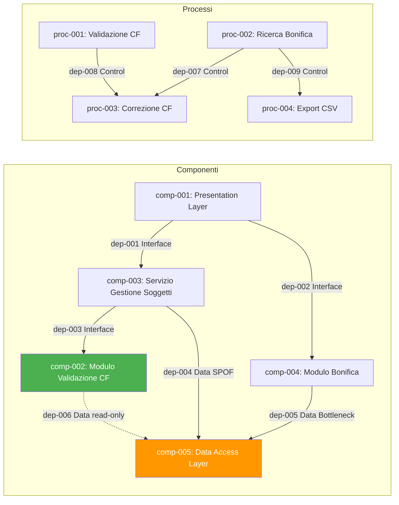

# dependency_map

## dependency_catalog

| dependency_id | source_id | source_type | target_id | target_type | dependency_type | dependency_description | coupling_level | risk_flag |
|---|---|---|---|---|---|---|---|---|
| dep-001 | comp-001 | Component | comp-003 | Component | Interface Dependency | La Presentation Layer invoca il Servizio Gestione Soggetti per salvare il soggetto (if-001). | Loose | None |
| dep-002 | comp-001 | Component | comp-004 | Component | Interface Dependency | La Presentation Layer invoca il Modulo Bonifica per ricerca, navigazione e export (if-002). | Loose | None |
| dep-003 | comp-003 | Component | comp-002 | Component | Interface Dependency | Il Servizio Gestione Soggetti chiama il Modulo Validazione CF ad ogni salvataggio soggetto (if-005). | Medium | None |
| dep-004 | comp-003 | Component | comp-005 | Component | Data Dependency | Il Servizio Gestione Soggetti legge/scrive ent-001 tramite il Data Access Layer (if-006). | Tight | Single Point of Failure |
| dep-005 | comp-004 | Component | comp-005 | Component | Data Dependency | Il Modulo Bonifica legge l'archivio soggetti tramite il Data Access Layer per le ricerche (if-008). | Tight | Bottleneck |
| dep-006 | comp-002 | Component | comp-005 | Component | Data Dependency | Il Modulo Validazione CF può leggere il Data Access Layer per dati anagrafici a supporto del calcolo CF atteso (read-only). | Medium | None |
| dep-007 | proc-002 | Process | proc-003 | Process | Control Dependency | La Ricerca Bonifica (proc-002) deve essere eseguita prima della Correzione CF (proc-003): il funzionario deve avere la lista per selezionare il soggetto. | Loose | None |
| dep-008 | proc-001 | Process | proc-003 | Process | Control Dependency | La validazione CF (proc-001) viene ri-eseguita durante proc-003 al salvataggio dalla bonifica. | Medium | None |
| dep-009 | proc-002 | Process | proc-004 | Process | Control Dependency | La ricerca bonifica (proc-002) deve essere attiva per poter eseguire l'export (proc-004). | Loose | None |
| dep-010 | ent-001 | Entity | ent-002 | Entity | Data Dependency | Il Soggetto (ent-001) contiene il CodiceFiscale (ent-002) come Value Object; ent-002 dipende dalla completezza di ent-001 per il calcolo CF atteso. | Medium | None |
| dep-011 | ent-004 | Entity | ent-001 | Entity | Data Dependency | Il RisultatoValidazione (ent-004) referenzia il Soggetto (ent-001). | Loose | None |
| dep-012 | ent-006 | Entity | ent-001 | Entity | Data Dependency | La RigaBonifica (ent-006) referenzia il Soggetto (ent-001) nell'archivio. | Medium | None |

## risk_analysis

| risk_id | risk_description | involved_elements | risk_severity | mitigation_suggestion |
|---|---|---|---|---|
| risk-001 | Il Data Access Layer (comp-005) è l'unico punto di accesso al database Oracle. Tutti i componenti applicativi dipendono da esso: guasto o degrado prestazionale impatta l'intera applicazione. | comp-003, comp-004, comp-002, comp-005 | Medium | Gestione connessioni con pool JBoss EAP; monitoring DB Oracle; ottimizzazione query bonifica con indici su paeseNascita e codiceFiscale. Separare le query di bonifica in sessioni dedicate per evitare contesa. |
| risk-002 | Il Modulo Bonifica (comp-004) esegue query su 10.000 soggetti entro 60 secondi (NFR-002). Query non ottimizzata può diventare collo di bottiglia e saturare il Data Access Layer, impattando le operazioni ordinarie (proc-001) in corso parallelo. | comp-004, comp-005, proc-002 | Medium | Creare indici composti su tabella soggetti per (paeseNascita, codiceFiscale). Eseguire ricerche bonifica in sessione separata con timeout esplicito. Considerare impaginazione progressiva per export CSV grandi. |
| risk-003 | Il Modulo Validazione CF (comp-002) implementa l'algoritmo ministeriale italiano. Variazioni normative richiedono modifica del codice (NFR-007). Se il modulo non è sufficientemente isolato, le modifiche all'algoritmo possono introdurre regressioni nei processi ordinari. | comp-002, proc-001 | Low | Garantire che comp-002 sia un modulo Java con interfaccia pubblica stabile. Coprire l'algoritmo con test unitari parametrici (UW-001÷004 in TEST_SPEC). Il modulo non deve avere dipendenze da framework Struts o strato persistence. |
| risk-004 | L'assenza di dati anagrafici completi impedisce il calcolo del CF atteso. In questi casi il sistema non può mostrare il CF atteso nell'avviso, riducendo l'utilità del feedback per il funzionario. | ent-001, ent-002, comp-002 | Low | Documentare nel manuale operativo che il CF atteso è mostrato solo se tutti i dati anagrafici sono presenti. Gap già segnalato in TEST_SPEC (UW-003 gap #3). |

## traceability_matrix

| requirement_id | entity_ids | process_ids | component_ids | dependency_ids |
|---|---|---|---|---|
| FR-001 | ent-001, ent-002 | proc-001 | comp-001, comp-002, comp-003 | dep-001, dep-003, dep-010 |
| FR-002 | ent-002, ent-004 | proc-001 | comp-002, comp-003 | dep-003, dep-010 |
| FR-003 | ent-002, ent-004 | proc-001 | comp-002 | dep-003 |
| FR-004 | ent-002, ent-003, ent-004 | proc-001 | comp-002 | dep-003, dep-010 |
| FR-005 | ent-003, ent-004 | proc-001 | comp-001, comp-002, comp-003 | dep-001, dep-003 |
| FR-006 | ent-001 | proc-001 | comp-003, comp-005 | dep-004 |
| FR-007 | ent-001, ent-002 | proc-001 | comp-002, comp-003 | dep-003, dep-010 |
| FR-008 | ent-001, ent-005, ent-006 | proc-002 | comp-004, comp-005 | dep-002, dep-005 |
| FR-009 | ent-001, ent-005, ent-006 | proc-002 | comp-004, comp-005 | dep-002, dep-005 |
| FR-010 | ent-001, ent-005, ent-006 | proc-002 | comp-004, comp-005 | dep-002, dep-005 |
| FR-011 | ent-001, ent-006 | proc-003 | comp-001, comp-004 | dep-002, dep-007, dep-012 |
| FR-012 | ent-005, ent-006 | proc-004 | comp-004, comp-005 | dep-002, dep-005, dep-009 |
| NFR-001 | ent-002, ent-004 | proc-001 | comp-002, comp-003 | dep-003 |
| NFR-002 | ent-005, ent-006 | proc-002 | comp-004, comp-005 | dep-005 |
| NFR-003 | — | proc-001, proc-002 | comp-001, comp-003, comp-004, comp-005 | dep-001, dep-002, dep-004, dep-005 |
| NFR-004 | ent-005, ent-006 | proc-002 | comp-004, comp-005 | dep-005 |
| NFR-005 | ent-005, ent-006 | proc-002, proc-004 | comp-001, comp-004 | dep-002 |
| NFR-006 | ent-003, ent-004 | proc-001 | comp-001, comp-002 | dep-001, dep-003 |
| NFR-007 | ent-002, ent-003 | proc-001 | comp-002 | dep-003, risk-003 |

## dependency_graph

DEPENDENCIES_COMPLETED